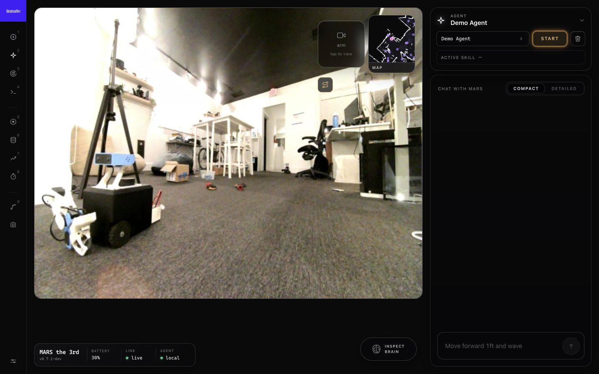

<!-- markdownlint-disable MD013 MD033 MD041 MD046 -->
<div align="center">

<p>
  
</p>

## Make MARS do new things with Python

Innate OS is the open-source software for building skills and autonomous agents on MARS.

[Try the simulator](#try-it-without-a-robot) · [Write a skill](#write-a-skill) · [Build an agent](#build-an-agent) · [Read the docs](https://docs.innate.bot)

[](https://discord.gg/innate)
[](https://docs.innate.bot)
[](https://innate.bot)

</div>

A **skill** makes the robot do one thing: navigate, grasp, speak, call an API, or run a learned policy. An **agent** observes the world and chooses which skills to run as it works toward a goal.

```text
camera + robot state → agent → skills → navigation · manipulation · speech · APIs
```

The same skills and agents run on a physical MARS and in the simulator.

<p align="center">
  
  
</p>

## Try it without a robot

The simulator runs the real Innate OS navigation stack, skills, agent runtime, and web app against a MuJoCo digital twin of MARS.

```bash
curl -fsSL https://link.innate.bot/sim | sh
cd innate-os
./innate-sim up
```

Open [https://localhost](https://localhost) to drive MARS, run skills and agents, and watch the simulated robot move through its environment.

Already have a checkout? Run `./innate-sim setup`, then `./innate-sim up`.

```bash
./innate-sim status          # Show runtime health
./innate-sim sh              # Open a shell in Innate OS
./innate-sim logs os-session # Inspect runtime logs
./innate-sim down            # Stop the simulator
```

See the [simulator guide](sim/README.md) for challenges, day-to-day development, the ROS-free VirtualMars API, and architecture.

## Write a skill

Skills are the reusable actions available to people, apps, and agents. A skill can control the robot, call another skill, use a digital service, or execute a learned manipulation policy.

Create `workspace/custom_skills/move_forward.py`:

```python
from innate import Mobility, Skill, SkillReturn


class MoveForward(Skill):
    """Move the robot forward by a given distance in meters."""

    mobility: Mobility

    def execute(self, distance_m: float = 0.5) -> SkillReturn:
        speed = 0.2
        duration = distance_m / speed
        self.mobility.send_cmd_vel(linear_x=speed, duration=duration)
        self.sleep(duration)
        return f"Moved forward {distance_m} m"
```

Innate OS injects the declared robot interface and handles cancellation. Saving the file hot-reloads the skill; run it from the robot or simulator shell:

```bash
innate skill run local/move_forward @distance_m=0.5
```

Built-in skills live in `workspace/innate_skills/`; your skills stay in the gitignored `workspace/custom_skills/`. See the [workspace guide](workspace/README.md) and [skills documentation](https://docs.innate.bot/software/skills) for composition, physical skills, shared helpers, inputs, and packaging.

## Build an agent

An agent continuously observes the robot and its environment, then selects and interrupts the skills it is allowed to use.

Create `workspace/custom_agents/navigate_agent.py`:

```python
from innate import Agent


class NavigateAgent(Agent):
    """Navigate to places requested by the user."""

    @property
    def id(self):
        return "navigate_agent"

    @property
    def display_name(self):
        return "Navigate"

    def get_skills(self):
        return ["innate-os/navigate_to_position"]

    def get_inputs(self):
        return ["micro"]

    def get_prompt(self):
        return "Navigate to the location requested by the user."
```

Saving the file makes the agent available in the web app. Test it in simulation before running it on a physical robot. See the [agents documentation](https://docs.innate.bot/software/agents) for observations, memory, prompts, skills, and custom inputs.

## Teach a skill from demonstrations

Some physical skills are easier to demonstrate than to program:

```text
record demonstrations → train a policy → deploy it as a skill → call it from an agent
```

Record episodes from the web or mobile app, train locally or with Innate Cloud, and deploy the resulting model back to MARS. Start with the [training overview](https://docs.innate.bot/training/overview).

## Control MARS

Every MARS serves its own web app at `https://<robot-address>`. Use it to drive, move the arm, run skills and agents, record demonstrations, and manage maps.

The Innate Controller app provides the same controls on iOS and Android:

- [iOS TestFlight](https://testflight.apple.com/join/YeChe4A7)
- [Android APK](https://cdn.innate.bot/innate-app-latest-1.3.0.apk)
- [Controller app documentation](https://docs.innate.bot/robots/innate-controller-app)

<p align="center">
  
  
</p>

## Go deeper

| I want to… | Start here |
|---|---|
| Build and package skills | [Workspace guide](workspace/README.md) · [Skills documentation](https://docs.innate.bot/software/skills) |
| Create autonomous agents | [Agents documentation](https://docs.innate.bot/software/agents) |
| Train and deploy manipulation policies | [Training overview](https://docs.innate.bot/training/overview) |
| Add a sensor or data source to agents | [Input device guide](docs/INPUT_DEVICES.md) |
| Develop without a robot | [Simulator guide](sim/README.md) |
| Understand the runtime | [System overview](docs/SYSTEM_OVERVIEW.md) |
| Debug ROS state, images, and transforms | [Foxglove guide](sim/README.md#foxglove) |
| Work on robot updates and services | [Update system guide](scripts/update/README.md) |

Innate OS is built on ROS 2 Humble with Zenoh as its DDS transport. Most builders should work through skills, agents, and the simulator; contributors changing the core runtime can start in [`ros2_ws/`](ros2_ws/) and the [system overview](docs/SYSTEM_OVERVIEW.md).

Innate OS is developed for MARS. If you port it to another robot, we would be happy to feature it.

## Contribute

Contributions, feedback, applications built on Innate OS, and ports to new robots are welcome. Open an issue or pull request, or join the community on [Discord](https://discord.gg/innate).
