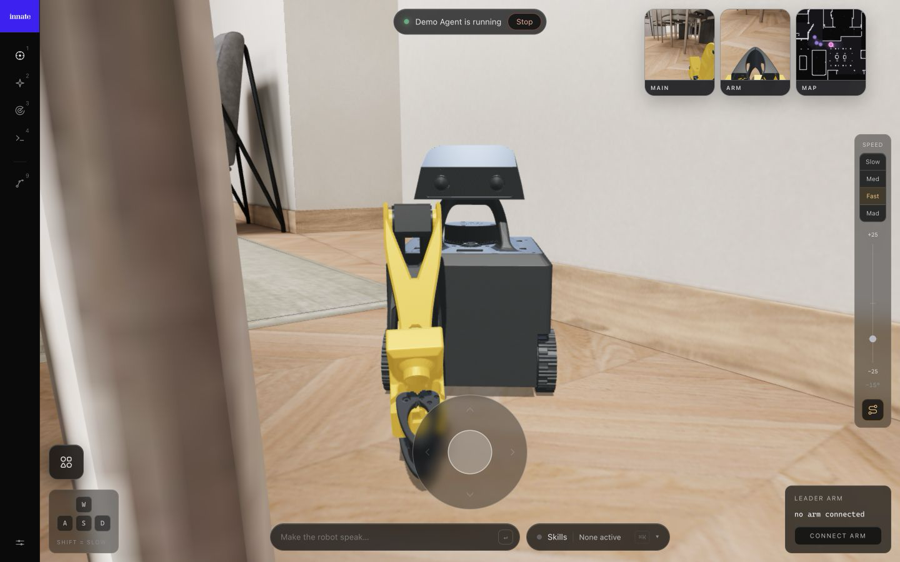
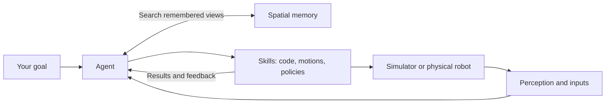
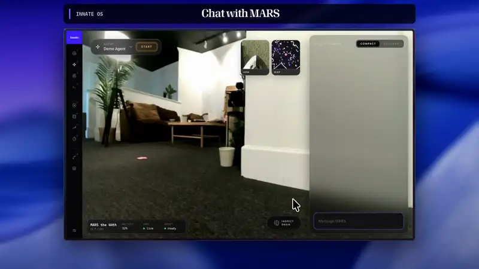

<!-- markdownlint-disable MD033 MD046 -->
<div align="center">

# Innate OS

**The open-source runtime for autonomous physical agents.**


Build autonomous robots from reusable skills, continuous perception, spatial memory, and learned policies. Run your agents in simulation, then on physical hardware.

[](https://sim.innate.bot)
[](#run-locally)

**No robot required to get started.**

[Documentation](https://docs.innate.bot) · [Discord](https://discord.gg/innate) · [Website](https://innate.bot)

</div>

## What you can build

| Agentic task execution | Spatial memory |
| --- | --- |
| Combine navigation, pick-up, and put-away skills around a goal. The agent observes while skills run and can interrupt them as the world changes. [See the demo agent →](workspace/innate_agents/demo_agent.py) | Ask about a place or object the robot has seen. Search remembered views for an image, map coordinates, and when it was seen, then navigate to the match. [See memory search →](workspace/innate_skills/search_memory.py) |
| **Learned manipulation** | **Simulation → hardware** |
| Record demonstrations, train a LeRobot policy, and deploy it as a skill alongside Python code and recorded motions. [Explore training →](https://docs.innate.bot/training/overview) | Build with the same agents, skills, and web app in the simulator and on MARS. Simulated hardware replaces physical drivers. [Build in simulation →](https://docs.innate.bot/simulator/building-with-the-simulator) |

<table>
  <tr>
    <td width="50%"></td>
    <td width="50%"><a href="https://sim.innate.bot"></a></td>
  </tr>
  <tr>
    <td><strong>Give the robot a new skill.</strong><br>Code, recorded motions, and learned policies share the same skill interface.</td>
    <td><strong>Try it before you have hardware.</strong><br>Drive, run skills, and talk to an agent in the browser.</td>
  </tr>
</table>

MARS is the supported reference hardware today. Innate OS separates agents, skills, and inputs from the robot drivers; ports to other robots are welcome and require hardware integration. [Hardware and control →](#hardware-and-control)

## Run locally

Start the simulator on macOS, Linux, or WSL2:

```bash
curl -fsSL https://link.innate.bot/sim | sh

cd innate-os
./innate-sim up
```

Open [https://localhost](https://localhost), accept the local self-signed certificate, and use the web app to drive, run skills, or talk to the agent. See [simulator setup](https://docs.innate.bot/simulator/setup) for agent keys and platform requirements.

Already cloned this repo? Run `sh scripts/install-sim.sh` from its root. A machine with 16 GB of RAM and four or more cores is comfortable; the first start downloads a few GB.

```bash
./innate-sim status
./innate-sim sh
./innate-sim logs startup
./innate-sim down
```

Your `workspace/` is mounted into the simulator. Skills and agents hot-reload on save; deploy the same files to MARS when you are ready to test on hardware.

**[Simulator guide →](sim/README.md)** · **[Build your first skill →](workspace/README.md)**

## How it works


```mermaid
flowchart LR
    Goal[Your goal] --> Agent[Agent]
    Observations[Perception and inputs] --> Agent
    Agent <-->|Search remembered views| Memory[Spatial memory]
    Agent --> Skills[Skills: code, motions, policies]
    Skills --> Robot[Simulator or physical robot]
    Robot --> Observations
    Skills -->|Results and feedback| Agent
```

The agent chooses skills from your Python workspace using camera observations, inputs, and skill feedback. It can search spatial memory for places outside the current view. Skills execute through the robot stack, built on ROS 2 Humble; the agent loop uses a vision-language model.

## Build an agent that remembers places

“Go to where you saw the guitar.” Give an agent memory search and navigation, then let it choose the calls:

```python
from innate import Agent, InputRef, SkillRef
from innate_skills.navigate_to_position import NavigateToPosition
from innate_skills.search_memory import SearchMemory
from inputs.micro_input import MicroInput


class FindPlaceAgent(Agent):
    @property
    def id(self) -> str:
        return "find_place_agent"

    @property
    def display_name(self) -> str:
        return "Find a remembered place"

    def get_skills(self) -> list[SkillRef]:
        return [SearchMemory, NavigateToPosition]

    def get_inputs(self) -> list[InputRef]:
        return [MicroInput]

    def get_prompt(self) -> str:
        return (
            "When asked to find a place or object, search memory first. "
            "Navigate to the returned map coordinates with local_frame=false. "
            "If there is no match, ask the user to show you rather than guessing. "
            "On arrival, check the camera and report what you see. "
            "If the user says stop, stop immediately and do not retry."
        )
```

Save this as `workspace/custom_agents/find_place_agent.py`, select **Find a remembered place** in the web app's Agent page, and ask about somewhere the robot has already seen on its current map. Memory needs recorded views to search; it cannot locate a place it has never observed.

This uses the same composition as the shipped [security guard agent](workspace/innate_agents/security_guard_agent.py). For manipulation, see the [demo agent](workspace/innate_agents/demo_agent.py), which adds pick-up, arm control, and drop-in-box skills.

## Extend the workspace

### Skills

A skill is a software call, a robot motion, or a learned policy. Run it from an agent, the [web app](https://docs.innate.bot/robots/web-app), or the [phone app](https://docs.innate.bot/robots/innate-controller-app).

Write your own in `workspace/custom_skills/`; built-in examples live in [`workspace/innate_skills/`](workspace/innate_skills/). Start with the [workspace guide](workspace/README.md), or explore:

- [SearchMemory](workspace/innate_skills/search_memory.py): retrieve remembered views by a natural-language query.
- [NavigateWithVision](workspace/innate_skills/navigate_with_vision.py): send a goal such as “walk to the red chair and stop” to the UniNavid cloud service, which streams movement commands back. Requires the navigation service to be configured and available.
- [PickAnyObject](workspace/innate_skills/pick_any_object.py): use vision and arm control to pick up an object.

**[Skills documentation →](https://docs.innate.bot/software/skills)**

### Agents

An agent combines skills, a prompt, inputs, and a loop that turns observations into actions. Put your agents in `workspace/custom_agents/`. List skills and inputs as classes, so your editor can catch reference errors before you run them.

**[Agents documentation →](https://docs.innate.bot/software/agents)**

### Inputs

Stream new data into a running agent — a sensor, a webhook, or an API. Devices live in `workspace/inputs/` and are requested by class. For example, add arm telemetry to an agent:

```python
from inputs.arm_vitals_input import ArmVitalsInput

from innate import InputRef


def get_inputs(self) -> list[InputRef]:
    return [ArmVitalsInput]
```

**[Input devices →](https://docs.innate.bot/software/inputs)**

## Hardware and control

[MARS](https://innate.bot) is our reference implementation: a mobile robot with an arm, cameras, and onboard compute. The simulator runs the software that ships on MARS with simulated hardware in place of physical drivers. Other robots need a hardware integration; [contributions and ports are welcome](.github/CONTRIBUTING.md).

<p align="center">
  
</p>

See what the robot sees and tell it what to do from your browser or phone. On a physical robot, open `https://<robot-address>`, or use the [Android APK](https://cdn.innate.bot/innate-app-latest-1.4.0.apk) or [iOS TestFlight](https://testflight.apple.com/join/YeChe4A7).

**[MARS quick start →](https://docs.innate.bot/get-started/mars-quick-start)** · **[Web app →](https://docs.innate.bot/robots/web-app)**

## LeRobot

MARS is a [LeRobot](https://github.com/huggingface/lerobot) robot. Record datasets while you teleoperate from the phone app or the web app, train any LeRobot policy on them, and run it back on the robot, with the standard commands and `--robot.type=mars`:

```bash
cd lerobot && uv sync
export MARS_HOST=192.168.1.42    # your robot's IP address
uv run hf auth login             # datasets upload to your Hugging Face account

uv run lerobot-record --robot.type=mars --robot.external_commands=true \
    --teleop.type=mars_passthrough --dataset.repo_id=YOUR_HF_NAME/mars-tidy-up \
    --dataset.single_task="Put the ball in the box" --dataset.num_episodes=10 \
    --dataset.private=true
```

You can also record in the web app or the phone app: the web app's Datasets page has a **Publish to Hugging Face** button that converts a recording to the same LeRobotDataset format.

**[MARS on LeRobot →](lerobot/README.md)**

## Documentation

This README is an introduction. The rest lives in the docs:

- [Building with the simulator](https://docs.innate.bot/simulator/building-with-the-simulator)
- [Workspace guide](workspace/README.md)
- [Getting started](https://docs.innate.bot/get-started/mars-quick-start)
- [Simulator](https://docs.innate.bot/simulator)
- [Skills](https://docs.innate.bot/software/skills)
- [Agents](https://docs.innate.bot/software/agents)
- [Input devices](https://docs.innate.bot/software/inputs)
- [Training](https://docs.innate.bot/training/overview)
- [MARS on LeRobot](lerobot/README.md)
- [Web app](https://docs.innate.bot/robots/web-app) and [controller app](https://docs.innate.bot/robots/innate-controller-app)
- [CLI](https://docs.innate.bot/software/innate-cli)
- [ROS 2 core and system overview](https://docs.innate.bot/software/ros2-core)

Most builders should start with skills, agents, inputs, and the simulator. Changing the ROS core is possible; it is not the usual path.

## License

Innate OS is open source under [Apache 2.0](LICENSE). Third-party code we ship is credited in [`NOTICE`](NOTICE).

The simulator's environments and characters are a separate matter: several are third-party works under CC BY 4.0, fetched at build time rather than stored here. They carry their own terms, listed per asset in [`sim/ATTRIBUTION.md`](sim/ATTRIBUTION.md).

## Contributing

We welcome contributions, apps built on Innate OS, and ports to other robots — we will be happy to feature them.

**[Contributing guide](.github/CONTRIBUTING.md)** · **[Discord](https://discord.gg/innate)**
