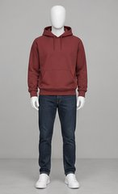
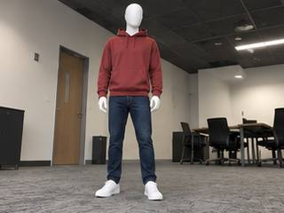
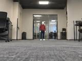
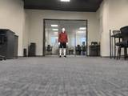

# Outfit matching: Astra 6 versus Gemini through Innate

Report generated 2026-09-09T15:19:03.997549+00:00.

**This measures matching synthetic clothing ensembles on blank mannequins. It does not measure facial recognition, body-based identity, or recognition of named people.**

15 reference outfits are included in every request. Each model sees the same 80 queries: 15 known and 5 unknown outfits across two viewpoints and two image sizes. There are 20 unique outfits, including only 5 unique unknowns. The scene appearance was informed by the supplied robot video; the scored images are generated.

| Model | Overall accuracy | Known outfit accuracy | Unknown rejection | Unknown false accepts | Abstentions / errors | Median / p95 latency |
|---|---:|---:|---:|---:|---:|---:|
| gpt-6-astra | 74/80 (92.5%) | 59/60 (98.3%) | 15/20 (75.0%) | 5/20 (25.0%) | 0 / 0 | 3.20s / 6.06s |
| gemini-3.6-flash | 77/80 (96.2%) | 60/60 (100.0%) | 17/20 (85.0%) | 3/20 (15.0%) | 0 / 0 | 2.98s / 4.75s |

The small distant views expose the main weakness: matching a known outfit can remain accurate while rejecting an unknown lookalike fails. The counts below separate those tasks.

- **gpt-6-astra**: nearby views 40/40 (100.0%); small distant unknowns falsely matched 5/5. Wrong answers had reported confidence 0.88–0.92.
- **gemini-3.6-flash**: nearby views 40/40 (100.0%); small distant unknowns falsely matched 2/5. Wrong answers had reported confidence 0.85–0.95.

The model's self-reported confidence is therefore insufficient by itself to prevent false matches in this sample. A larger test on real robot outfit footage would be needed before choosing a system. These results cannot establish personal identity recognition or performance after clothing changes.

## Conditions

| Condition | Model | Known accuracy | Unknown rejection | Unknown false accepts | Balanced accuracy |
|---|---|---:|---:|---:|---:|
| low_angle_320 | gpt-6-astra | 15/15 (100.0%) | 5/5 (100.0%) | 0/5 (0.0%) | 100.0% |
| low_angle_320 | gemini-3.6-flash | 15/15 (100.0%) | 5/5 (100.0%) | 0/5 (0.0%) | 100.0% |
| low_angle_160 | gpt-6-astra | 15/15 (100.0%) | 5/5 (100.0%) | 0/5 (0.0%) | 100.0% |
| low_angle_160 | gemini-3.6-flash | 15/15 (100.0%) | 5/5 (100.0%) | 0/5 (0.0%) | 100.0% |
| distant_320 | gpt-6-astra | 15/15 (100.0%) | 5/5 (100.0%) | 0/5 (0.0%) | 100.0% |
| distant_320 | gemini-3.6-flash | 15/15 (100.0%) | 4/5 (80.0%) | 1/5 (20.0%) | 90.0% |
| distant_160 | gpt-6-astra | 14/15 (93.3%) | 0/5 (0.0%) | 5/5 (100.0%) | 46.7% |
| distant_160 | gemini-3.6-flash | 15/15 (100.0%) | 3/5 (60.0%) | 2/5 (40.0%) | 80.0% |

`320` means 320×240 pixels; `160` means 160×120 pixels. Both views are from a low camera. The distant scene has a smaller subject in the frame. Viewpoint and distance are synthesized, not metrically calibrated.

`UNKNOWN` is explicit rejection; `UNCERTAIN` is abstention. Errors and abstentions count as incorrect. An always-unknown classifier would get 25% overall accuracy and 50% balanced accuracy. Uniform guessing among the 15 reference labels gives 6.7% known-outfit accuracy.

## What failed

**gpt-6-astra**: 6 incorrect decisions or errors.

- [distant_160_04](assets/queries/distant_160_04.jpg): expected `OUTFIT_04`, got `OUTFIT_12` (confidence 0.91; incorrect / abstention / error).
- [distant_160_17](assets/queries/distant_160_17.jpg): expected `UNKNOWN`, got `OUTFIT_12` (confidence 0.92; false accept of unknown).
- [distant_160_20](assets/queries/distant_160_20.jpg): expected `UNKNOWN`, got `OUTFIT_12` (confidence 0.9; false accept of unknown).
- [distant_160_18](assets/queries/distant_160_18.jpg): expected `UNKNOWN`, got `OUTFIT_03` (confidence 0.88; false accept of unknown).
- [distant_160_16](assets/queries/distant_160_16.jpg): expected `UNKNOWN`, got `OUTFIT_01` (confidence 0.91; false accept of unknown).
- [distant_160_19](assets/queries/distant_160_19.jpg): expected `UNKNOWN`, got `OUTFIT_02` (confidence 0.88; false accept of unknown).

**gemini-3.6-flash**: 3 incorrect decisions or errors.

- [distant_320_17](assets/queries/distant_320_17.jpg): expected `UNKNOWN`, got `OUTFIT_04` (confidence 0.95; false accept of unknown).
- [distant_160_17](assets/queries/distant_160_17.jpg): expected `UNKNOWN`, got `OUTFIT_04` (confidence 0.95; false accept of unknown).
- [distant_160_20](assets/queries/distant_160_20.jpg): expected `UNKNOWN`, got `OUTFIT_04` (confidence 0.85; false accept of unknown).

## Example inputs

Known outfit 1: catalog, low view, and distant view. The distant query below is 160×120.

Unknown outfit 16 resembles outfit 1 but has black shorts and black shoes:

## API settings, usage, and reproducibility

- **astra-low**: requested `gpt-6-astra`; returned gpt-6-astra; reasoning `low`; 80 saved requests. [Configuration](results/astra-low/config.json), [CSV](results/astra-low/predictions.csv), [Raw output and usage](results/astra-low/predictions.jsonl).
  Input tokens 95,840; cached reads 0; cache writes 95,600; output tokens 3,526. Estimated standard API inference cost **$1.374**, using [published Astra rates](https://developers.openai.com/api/docs/models/gpt-6-astra). This excludes image generation, the separate connectivity check, and taxes; it is not an invoice.
- **gemini-low**: requested `gemini-3.6-flash`; returned gemini-3.6-flash; reasoning `low`; 80 saved requests. [Configuration](results/gemini-low/config.json), [CSV](results/gemini-low/predictions.csv), [Raw output and usage](results/gemini-low/predictions.jsonl).
  Prompt tokens 1,426,720; output tokens 1,547; reported thinking tokens 15,325. Innate proxy billing was not available; no dollar estimate is asserted.

Latency is wall-clock time to completion, including the network and proxy. The models run sequentially within each provider, with the two providers overlapping. Reasoning settings and provider image processing do not imply equal compute. There are no automatic retries and no threshold tuned on these test outcomes.

## Limits on conclusions

The generated outfits and mannequin scenes are a small feasibility pilot, not a deployment validation set. Strong results can reflect conspicuous garment colors and synthesis consistency. There are no clothing changes, crowds, severe occlusions, or calibrated real-camera corruption.

Only five unique unknown outfits were tested. Results pooled over views and sizes are correlated. Even 0/5 errors in one condition would leave a one-sided 95% binomial upper bound near 45% under an independent-sample assumption. This pilot cannot establish a rare false-accept rate.

[Full protocol and reproduction instructions](README.md), [dataset manifest](manifest.json), [panel QA notes](QA.md).
