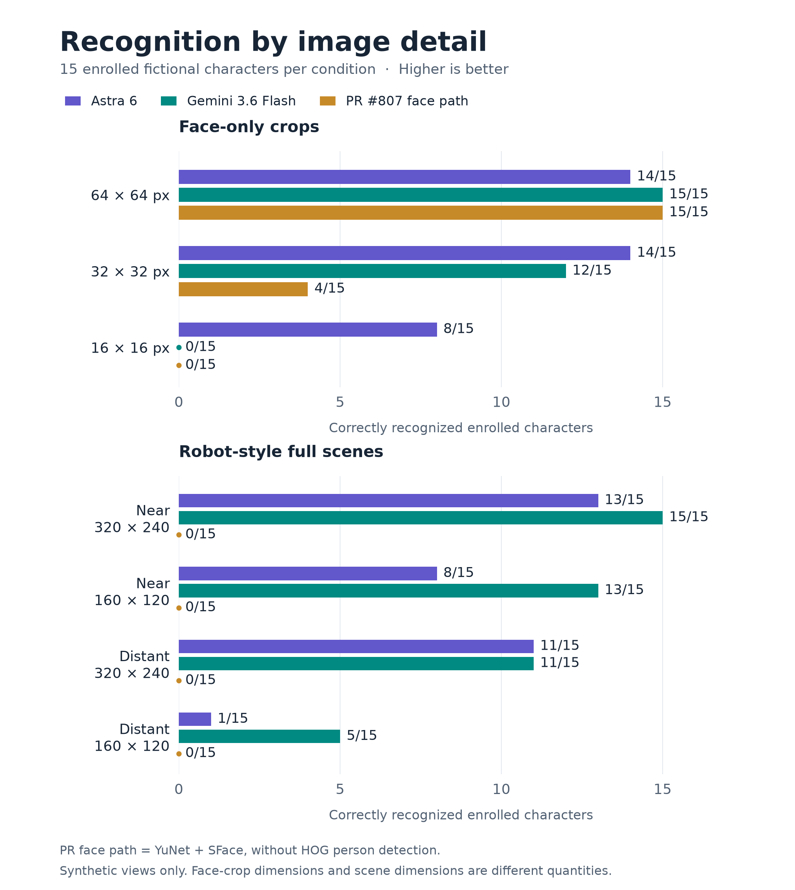
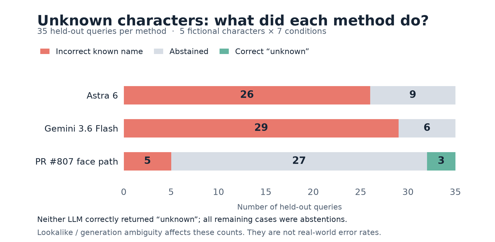
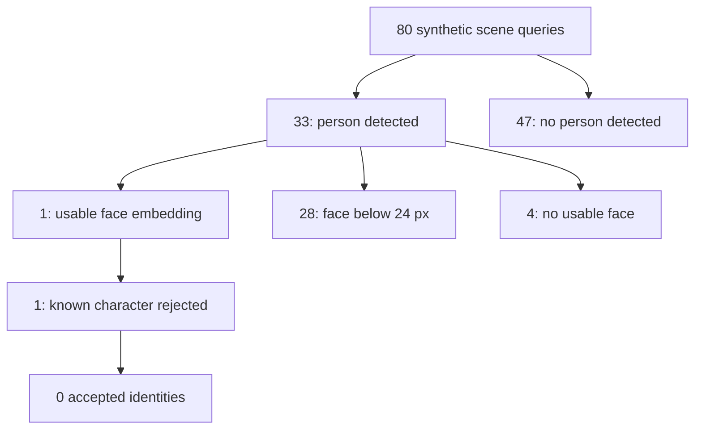

# Benchmark graphics

The separate PR diagnostic includes HOG person detection, YuNet face localization and SFace matching. It processes 80 synthetic scene queries, with no outfit fallback or temporal enrollment.

Vector exports: [recognition](recognition-by-detail.svg), [unknown outcomes](unknown-outcomes.svg). Diagram source: [Mermaid](pr807-pipeline.mmd).

The figures read the completed prediction files; no model inference is repeated. Counts and source hashes are recorded in [figure_data.json](figure_data.json). To reproduce, install Matplotlib and run `python benchmarks/synthetic_people/figures/make_figures.py`.

Only 20 fictional characters are present, including five held-out characters repeated in seven conditions. Generated lookalikes may be ambiguous. These results cannot establish real-world facial recognition accuracy.
