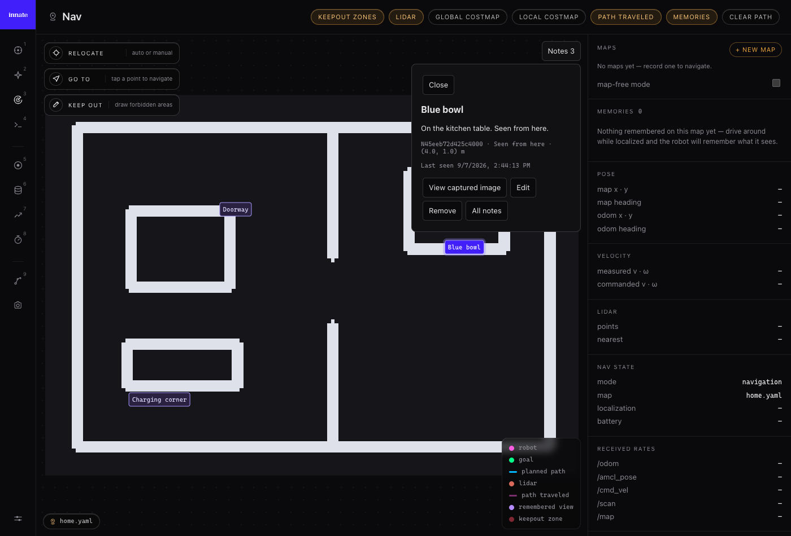
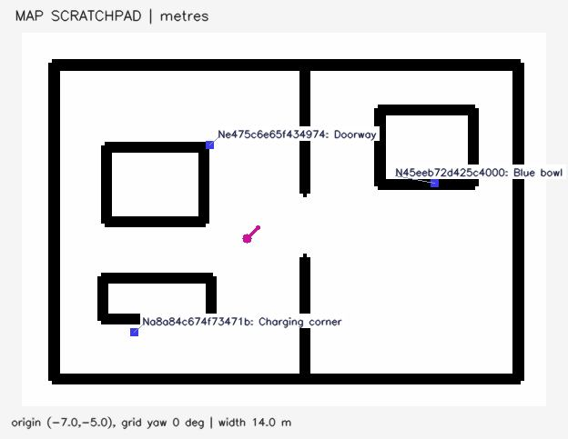

# Map scratchpad

Astra can explicitly remember, inspect, correct, and remove short observations on the current saved map. Navigation and Teleop show the same notes. No observer model runs in the background.

On every decision, the main agent receives both a current text snapshot and a compact **annotated map image**. It does not need a read tool call to discover the five most relevant notes. This context is inserted immediately before the current camera observation and is never absorbed into conversation history. The next request reflects edits and removals; an inference already in progress may still describe its earlier snapshot. Historical tool results are explicitly superseded by the current scratchpad.

The UI below is the actual webapp against a synthetic map and ROS fixture:



The main agent receives this separate annotated map image, alongside the note text and live camera:



## Anchors and evidence

An agent-created note means **seen from here**, anchored to the robot's map pose sampled with that decision's camera observation. It is not a measured object position. The note retains the exact JPEG shown in that turn, a timestamp, heading, and `observed` or `uncertain` certainty. Pose and camera acquisition are close in time but are not hardware timestamp synchronized. The robot must be localized on a saved map to create an observation note. A stale or missing observation cannot create a note.

An operator can add a **known map position** by choosing Add note and clicking the map. Coordinates must be finite and inside its grid. An operator point has no captured camera evidence. Text edits preserve the original anchor/evidence; an agent can explicitly relocate a note to a new observation.

Only explicit Astra or operator writes create notes. The existing automatic camera memories and `search_memory` skill remain independent.

## Main-agent context and speed

- Up to five notes, ranked by lexical task relevance, distance, then update time. Each includes ID, record revision, title, location/anchor, observed time, certainty, and at most 180 text characters. Full text is available through `read_map_notes`.
- One map JPEG, at most 624 × 520 pixels including margins, with note labels, robot position/heading, map scale and orientation. Squares mark observation viewpoints; circles mark operator points. Unselected notes appear as small dots.
- Map rendering is cached until the map, note revision, selected notes, or robot's 0.25 m / approximately 15° pose bucket changes. The current cached image is still included on every decision request.
- Local deterministic operations: no second model call and no physical skill slot. These tools stay available while a movement skill runs. Camera evidence is returned only on explicit read, at most two images per call, and enters the next turn as labeled historical evidence.
- Maximum 1,000 active notes per map; titles are 80 characters and text is 800 characters. This is a bounded scratchpad, not an unlimited archive.

A 1,000-note fixture on the development Mac measured p95 read around 9 ms, context preparation including image rendering around 11 ms, and mutations below 3 ms. These are local CPU/storage timings, not Jetson or model-latency measurements. Jetson timing and a physical robot rollout remain unverified.

## Astra tools

Native Responses function declarations use `strict: true`, `additionalProperties: false`, required keys, and nullable optional values. Existing physical skill schemas keep their previous strictness behavior.

| Tool | Arguments | Behavior |
| --- | --- | --- |
| `read_map_notes` | `query: string|null`, `note_ids: string[]|null`, `near: {x,y,radius_m}|null`, `include_evidence: boolean`, `limit: integer` (1–20) | Search by text, IDs, or radius; return full records and optionally captured images. Empty matches succeed with an empty list. |
| `write_map_note` | `note_id: string|null`, `expected_revision: integer|null`, `title`, `text`, `certainty: observed|uncertain`, `observation_id: string|null` | Null ID/revision creates using the current context's observation ID. Updating requires the existing ID/revision. Null observation ID on an update preserves its anchor and image. |
| `remove_map_note` | `note_id: string`, `expected_revision: integer` | Remove exactly one note and its evidence. No bulk delete. |

The runtime binds map identity and native function-call ID. The observation ID is provided in the current scratchpad; it refers to the frame shown before inference, never a later camera frame. Observation creates expire after 120 seconds. A revision conflict returns `current_revision`; reread before deciding whether to retry.

Errors include `NO_ACTIVE_MAP`, `MAP_CHANGED`, `OBSERVATION_EXPIRED`, `INVALID_ARGUMENT`, `INVALID_ANCHOR`, `NOTE_NOT_FOUND`, `REVISION_CONFLICT`, `CALL_ID_REUSED`, `NOTE_LIMIT_REACHED`, `TURN_CANCELLED`, and `STORE_UNAVAILABLE`.

## Store and ROS boundary

`data/map_notes.sqlite3` stores JSON note records and JPEG evidence in one SQLite transaction with WAL enabled. Notes are scoped by saved map name, occupancy fingerprint, and a hash of the map YAML. Switching maps, same-name remapping, and changing YAML origin/resolution select a different namespace. Unsaved mapping and map-free mode have no writable scratchpad. The recorder detaches the old identity as soon as its mode/map callback changes, before its periodic recording tick.

Every update/remove checks `expected_revision`. Mutations acknowledge only after commit. Native-call retries replay the prior result; reuse of a call ID with different arguments is rejected. Retry metadata is capped at 4,096 calls. Deleted records remain tombstones, with their JPEG removed, so delayed edits cannot resurrect them. V1 has no undo or automatic map-note migration. Notes for inactive maps remain on disk, and returning to an unchanged map restores them.

The brain node exposes:

- `/brain/map_notes` topic (`std_msgs/msg/String`): full `{map_ref, revision, notes}` snapshot, latched and published when it changes. A 250 ms local timer picks up agent writes.
- `/brain/map_notes` service (`brain_messages/srv/MapNotes`): JSON `request` and `response` strings. Requests contain `{operation, arguments, map_ref, request_id}`; `snapshot` fetches current state. Operator writes additionally accept `map_point: [x,y]`. Successful mutations return the note/result plus the current snapshot.

Both agent and ROS service use the same store and validation. Snapshot reloads handle reconnects; revision checks reject stale UI messages and preserve unsaved editor text on conflicts. All text uses DOM text nodes. Note pins do not dispatch navigation. Teleop thumbnails keep pins passive until the map is expanded.

The store and tools execute under the existing active-turn gate. An abandoned model response cannot reach tool dispatch; writes recheck map identity and activation before commit. A scratchpad database failure is reported without requiring another model call; failure to initialize the database leaves the brain running without note tools.

## Verification

Core tests (no ROS/network):

```sh
PYTHONPATH=ros2_ws/src/brain/brain_client:workspace python -m pytest -q \
  ros2_ws/src/brain/brain_client/test/test_map_notes.py \
  ros2_ws/src/brain/brain_client/test/test_local_brain.py \
  ros2_ws/src/brain/brain_client/test/test_openai_context.py \
  ros2_ws/src/brain/brain_client/test/test_openai_transport.py
```

Build `brain_messages` for the new service before running the node. In a sourced ROS workspace, `test_map_notes_ros.py` checks the service boundary and immediate map-transition gating.

For the actual browser integration, run `ros2_ws/src/brain/brain_client/test/map_notes_fixture.py` and `ros2 run rosbridge_server rosbridge_websocket`, then serve the webapp with its `/ws` proxy. Run `python webapp/tests/map_notes_browser.py --url <local-fixture-url> --chrome <chrome-executable>`. The fixture exposes test-only services; never point the test at a physical robot. It exercises real pages and ROS requests: no-map/restore, captured image, edit, concurrent write conflict, click-to-create, Teleop read/remove, reload, and mobile editor. It makes no model calls and does not simulate physical motion.
