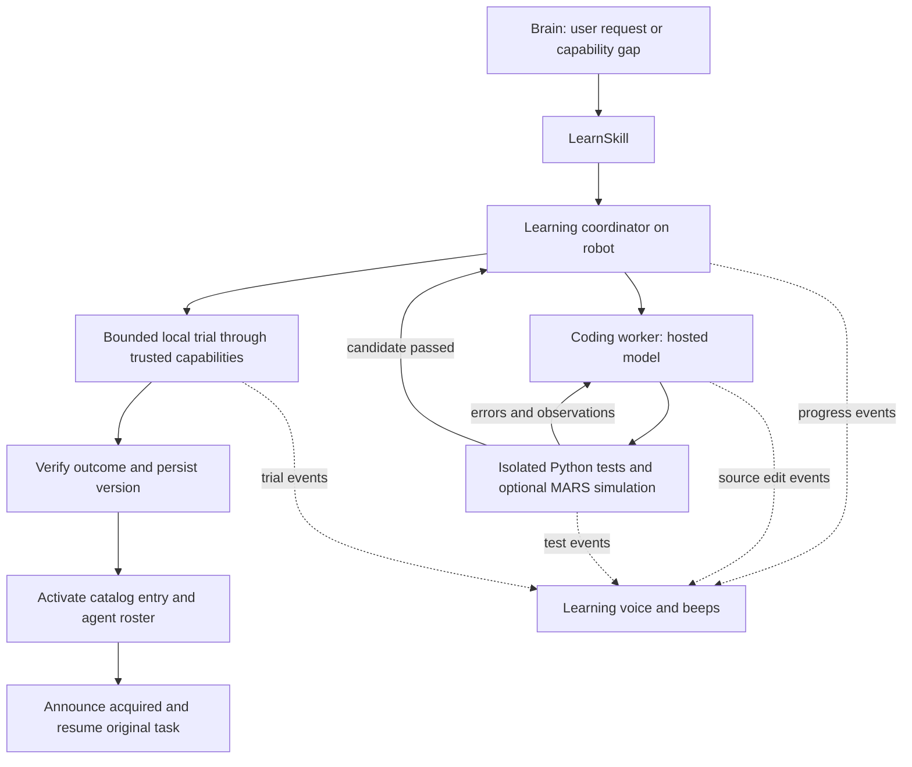

# Learning mode for MARS

Research and architecture proposal, 9 September 2026. This document proposes a feature; it does not implement or enable autonomous skill generation.

Build a `LearnSkill` entry point backed by a coding worker, an isolated test runner, and a persistent library of verified skills. A separate presentation controller turns real progress into the learning voice, code chatter, and beeps. Keep the existing brain as the task planner and the existing robot controllers as the actuators.

The first version learns reusable Python programs and assets. A successful session adds a capability to the library without updating model weights. Learning a new grasp or a new motor policy would use the existing demonstration/training pipeline or a separate training job.

**Examples that inform the design**

| Example | Demonstrated mechanism | Application to Innate |
|---|---|---|
| [Voyager](https://voyager.minedojo.org/) and its [implementation](https://github.com/MineDojo/Voyager/blob/main/voyager/voyager.py) | Generates executable behaviors, uses execution feedback to revise them, retrieves previous skills, and stores successful programs. The environment is Minecraft. | Use its write → execute → inspect → repair → remember loop. Start learning to meet a user's goal or a diagnosed capability gap. |
| [Code as Policies](https://code-as-policies.github.io/) | Generates Python that composes perception and control APIs into robot behaviors. | Give the worker a small, documented set of Innate capabilities and examples. Extend behavior through composition. |
| [SayCan](https://say-can.github.io/) | Combines language-based usefulness with estimates of whether a robot skill can succeed in the current situation. | Check whether the robot has the hardware, inputs, and environmental conditions to attempt the proposed skill. These checks are a simplified adaptation, not an implementation of SayCan's learned scoring. |
| [Eureka](https://eureka-research.github.io/) | Generates reward code and evaluates it through GPU-accelerated reinforcement learning in simulation. | A possible later path for new motor policies. Its training loop is a different workload from generating a short dance routine. |
| [smolagents execution guide](https://huggingface.co/docs/smolagents/main/tutorials/secure_code_execution) | Separates generated Python execution from the calling application and describes local and remote execution options. | Use an isolated execution boundary. Import restrictions and static checks are useful filters, but cannot make arbitrary Python safe inside the live ROS process. |

These examples support the mechanisms above. The architecture below is a recommendation for this repository, not a benchmarked claim that one research system is universally best.

**What already exists in Innate**

The implementation was checked directly because some older design documents describe superseded loading and cloud-registration behavior.

| Existing component | Consequence for this feature |
|---|---|
| `innate` authoring API and `Skill` subclasses | Reuse typed inputs, results, feedback, overlays, and cancellation at the public skill boundary. |
| `skills/workspace_import.py:import_workspace_packages` | Workspace packages are actually imported. Python at module scope can run during discovery. Drafts and generated tests must live outside every discovered package and watched workspace root. |
| `skills/catalog.py:reload_all` / `reload_selective` | Even selective reload currently performs a full reload. Stream edits into staging, then activate one complete version. |
| `skills/roster.py:active_skill_ids` | Being in the catalog does not make a skill available to the current agent. Activation must also update the permitted active subset. The brain reads this roster on its next turn. |
| `brain/tools.py:build_tools` and `nodes/skills_server.py` | A running skill occupies the robot's action slot. The brain can converse or stop it, but cannot start another ordinary skill alongside it. |
| `skills/invoker.py:SkillInvoker` | Trusted child skills can run sequentially under a parent goal. Use this path for local trials instead of recursively submitting another root action. |
| `skills/types.py:Skill.sleep` | Cooperative cancellation is available. A separate process deadline is still needed for generated code that loops without reaching a checkpoint. |
| `skills/types.py:Skill.say`, `transport/tts.py` | Skill speech currently sends plain text. The TTS layer has per-utterance voice configuration internally, but the public skill call does not expose the proposed learning audio profile. |
| `workspace/inputs/micro_input.py` | Real microphone audio is discarded while the robot is speaking. Continuous learning chatter would suppress spoken interruptions. |
| `config/alsa/asound.conf` | ALSA software mixing is configured, but priority, per-job cancellation, and matching browser playback still need an audio controller. |
| MARS simulator / `mars_sim_driver` | Existing simulation can test motion using the robot's software interfaces. The simulator guide recommends 16 GB RAM for comfortable use, so run full simulation on a workstation or server. |

**Runtime arrangement**



Run the coordinator and audio locally. Use a hosted coding model and an off-robot sandbox for writing and tests. Keep only a small Python worker on the Jetson when execution needs local observations; control stays in the existing robot stack. Start with one coding session at a time, an explicit state machine, and ordinary persisted job records. A distributed workflow framework or multiple model agents are not needed for the first version.

`LearnSkill.execute(...)` starts the job and services progress with cancellable waits. It owns the single robot action slot while learning. The brain continues to receive user input, can answer questions, and can stop the job. The robot remains stationary during writing and remote tests; a local trial is an explicit state transition.

Proposed inputs are `goal` and optional `name`. The coordinator derives budgets, available capabilities, and allowed test effects from configuration and the current request. The model cannot increase its own permissions by supplying tool arguments.

**When learning starts**

Start with explicit requests such as “learn a victory dance.” Add automatic learning after the first version works reliably.

For automatic entry, collect the goal, recent attempts, errors, and relevant observations. Retrieve existing skills first. If the needed skill exists but is inactive, enable it when allowed. If a known skill can complete the task with corrected inputs, retry it within a small recovery budget.

Classify the remaining failure: missing procedure, missing perception or motor capability, unavailable input/service, or an environmental obstacle. Code generation is useful for a missing procedure. An offline camera or an obstacle that physically blocks the robot generally needs recovery or help. Record failed learning attempts and their reasons so the same unchanged situation does not restart the loop indefinitely.

Suggested initial limits: three candidate versions and a three-minute total job deadline, plus a model-call budget. These are tunable product defaults, not measured learning times. A timeout reports what remains missing and preserves the draft. Do not spend the deadline on an artificial waiting animation.

**What the coding worker produces**

Each version contains Python source, a manifest, test cases, optional assets, and evidence from execution. The manifest records the skill ID, display name, input schema, required capabilities, preconditions, runtime limit, SDK version, source digest, and verification status. The coordinator owns activation status and the evidence record.

Suggested storage, all outside `workspace/`:

```text
~/.local/share/innate/learning/
    jobs/<job-id>/                 request, candidate source, tests, event log
    skills/<skill-id>/<digest>/    immutable verified source and assets
    library.sqlite                active version, conditions, outcome history
```

The worker receives versioned capability definitions, a few relevant existing examples, the task's acceptance criteria, and recent failures. It has tools to read supplied references, edit its candidate, and run tests. Network research, when needed, belongs to the authoring side; fetched content is evidence, not an instruction to change the robot's authority.

Use a narrow generated-code API, for example `execute(ctx, **inputs)`, with `ctx.call_skill`, observation reads, cancellable sleep, and feedback. This API is proposed and does not exist today. Tests substitute deterministic fake capabilities; simulation and hardware supply different implementations of the same contract. Existing handwritten `Skill` subclasses remain the integration surface for the rest of Innate.

A trusted `GeneratedSkill` adapter should expose each verified bundle as a normal catalog skill while executing its Python in an isolated worker. If using the existing package loader, emit only deterministic wrapper modules from a trusted template into `custom_skills`; the wrappers reference verified bundles and never import their Python into the ROS process. Validate identifiers and serialize all metadata rather than interpolating model text into executable templates.

For the first sound and dance examples, the worker can generate a WAV or a bounded motion plan in isolation. A trusted player then executes the resulting data. Preserve the source as part of the learned skill so it can be parameterized, inspected, and revised. This reduces the amount of generated code that needs to run during physical execution. Add persistent, reactive Python workflows when a use case needs them.

**Testing, trials, and activation**

1. Define observable success before writing: the requested sound exists and plays, the dance completes within its motion envelope, or the requested cart matches its specification.
2. Check syntax, schema, permitted dependencies, input bounds, cancellation behavior, and declared capabilities. Run generated tests in isolation alongside coordinator-owned checks the worker cannot rewrite.
3. Execute with fake capabilities; test failures, timeouts, invalid inputs, and Stop. For motion, run the same candidate in a separate simulator with varied relevant starting conditions. Keep that simulator's ROS/Zenoh connectivity isolated from hardware.
4. If local execution is needed and allowed, run a bounded trial through trusted capabilities. The action broker validates every call against the session's capability set and runtime limits. It invokes permitted child skills through the parent's execution context; it does not expose the server's unrestricted invoker to generated code.
5. Inspect outcome evidence. A Python return value saying “success” is insufficient. Use runner-owned logs, observed state, artifact measurements, or a service response. Use human preference feedback for subjective qualities such as whether the dance looks good.
6. Persist the exact verified digest and its dependencies, then register and enable it for the requesting agent when permitted. Complete `LearnSkill` and release its action slot before the coordinator announces acquisition and the next brain turn uses the new skill. Require activation acknowledgement first. Resume the original task from fresh observations; reuse a successful trial's result if it already fulfilled the request, avoiding a duplicate physical or external action.

The isolated worker should have bounded CPU, memory, process count, output size, and time, with no direct hardware devices, ROS/Zenoh credentials, Docker socket, or general access to the robot's filesystem. A trusted broker provides narrowly scoped capabilities and owns credentials. Isolation must remain in place when the saved skill is used later; passing tests is not a reason to move arbitrary Python into the live server.

Stop cancels the worker and any active child, revokes further action calls, stops learning audio, and invokes the existing robot cleanup behavior. A parent watchdog handles a hung worker independently of Python checkpoints. Preserve documented committed-action cleanup where the existing robot skill requires it. Timeout, cancellation, and late worker results must never activate a version after the job has ended.

Persist versions before changing the active pointer. Retain the previous working version for rollback. Revalidate after SDK or dependency changes. A version proved only in simulation remains marked as such until an appropriate physical trial; activation in hardware mode must respect that status. A failed effectful trial may require reconciliation before retrying—file rollback cannot undo a purchase or physical action.

**The learning performance**

The presentation controller subscribes to events such as `learning_started`, `source_changed`, `test_started`, `test_failed`, `trial_started`, `activated`, and `cancelled`. It cannot activate a skill itself.

| Stage | Robot behavior |
|---|---|
| Entry | Normal voice: “Activating learning mode. Give me a moment.” |
| Writing | Short bursts of actual newly written code, spoken rapidly with a deeper voice and lower volume. Show source and progress in the web app. |
| Waiting/testing | Occasional game-like beeps; announce a meaningful transition when useful. Code chatter follows actual source edits. |
| Local trial | “Testing the new skill.” Suspend chatter so the trial's sound or motion is clear. |
| Activated | Flush chatter, play a short acquisition sound, then normal voice: “New skill: [name]. Acquired.” |
| Failed/cancelled | Stop the effect immediately and report the actual outcome. Preserve a useful draft without claiming acquisition. |

Suggested audio settings to tune on the robot: 1–3 second chatter bursts, roughly 1.8–2.5 times normal playback speed, a deep voice or independent downward pitch shift, and beep intervals sampled uniformly between 7 and 13 seconds. Vary the short beep motif, not just the interval. These numbers are design targets requiring a listening test.

Read source edits after they are emitted or written, chunked at sensible boundaries. Speak selected new lines, with duplicate and stale chunks dropped and sensitive literals redacted. Do not voice internal model reasoning or invent progress. Keep at most a few seconds of pending chatter; acquisition speech should never sit behind a minute of source code.

Use a dedicated low-priority learning audio channel with cancellation keyed by job ID. Normal conversation preempts it. Mix beeps and chatter with per-channel gain through one controller; provide matching behavior for local speakers and simulator/browser playback. Cache the entry line and beep assets locally, so TTS network delay does not delay the start of learning.

The current TTS speaker path requests Cartesia `sonic-3.5` with speed `1.5`. The [current Cartesia guide](https://docs.cartesia.ai/build-with-cartesia/capability-guides/volume-speed-emotion) documents speed guidance from 0.6 to 1.5 and says its controls are guidance rather than strict transformations. For the exaggerated effect, use pitch-preserving time compression plus a deep voice or separate pitch processing. Simply raising the sample playback rate would also raise pitch. Benchmark the DSP on the Jetson and keep it off the ROS executor.

Initially leave audible listening gaps between bursts because the current mic is suppressed during playback. Those gaps improve availability but do not guarantee recognition of a Stop spoken during a burst; retain an immediate UI Stop. Continuous narration with reliable voice interruption requires a tested echo-cancellation/barge-in path. Every sound source must participate in the audio activity policy so the robot does not transcribe its own code chatter.

**How the three examples differ**

| Desired skill | Generated work | Verification and first release scope |
|---|---|---|
| Make a new sound | Python synthesizes a bounded WAV, or parameterizes a known sound generator. | Check decoding, duration, non-silence, peak level, and asset size; preview through the robot's existing volume setting. Ask for aesthetic feedback when useful. This is the best first end-to-end demo. |
| Learn to dance | Python composes permitted head/arm/base primitives or produces a timed motion plan. | Begin with a short head routine using existing movement patterns. Add simulation and a bounded physical trial before extending to arm/base choreography. Verify positions, duration, motion envelope, cancellation, and a stable end state. |
| Order DoorDash | Python orchestrates a supported ordering integration or an authenticated browser workflow. | First confirm an actual available integration. Exercise catalog/cart operations against fixtures or an appropriate test environment. Separate preparing a cart from committing an order; bind any purchase authority to the concrete order or existing user limits. Track transaction identifiers so a retry cannot duplicate an order. |

DoorDash's public documentation describes Drive as merchant-originated delivery fulfillment and says Marketplace APIs are not generally available. Those services do not establish a general consumer checkout API for this robot. A consumer ordering path needs separate integration discovery and testing. Treat missing authentication/access as a dependency, not something a coding loop can invent. [DoorDash developer FAQ](https://developer.doordash.com/en-US/docs/marketplace/faq/getting_started/)

For shopping tests, verify what is actually covered: a prepared cart can be acquired and named as a cart-preparation skill; an untested checkout should remain unverified. Payment credentials stay with the trusted integration. Uncertain responses require order-status reconciliation before another submission.

**Recommended implementation sequence**

1. Build one explicit `LearnSkill` flow for “make a new sound,” including source generation, isolated execution, measured artifact checks, preview, persistent activation, and reuse after restart. Add the learning audio controller at the same time so the experience is testable end to end.
2. Add a short head dance, fake-capability tests, simulator evaluation, and bounded child execution. Connect the existing overlay to job stages and show test evidence.
3. Add automatic capability-gap detection, retrieval, failure memory, and session budgets. Persist allowed learned-skill activation per agent, preserving existing agent restrictions.
4. Add service/browser adapters when concrete integrations are available. Extend to new trained motor policies through the recording/training path when composition is insufficient.

Before enabling automatic entry, demonstrate: a failed candidate is repaired; failed and cancelled drafts remain inactive; Stop works during writing, tests, and a trial; stale audio stops; activation failure produces no acquisition announcement; the saved skill survives restart and is callable by the intended agent; a second request reuses it without another learning session.

The smallest convincing demo is: “Invent a little victory sound” → real code chatter and beeps → audible trial → “New skill: Victory Chirp. Acquired.” → “Play your victory chirp again,” including after restart.
