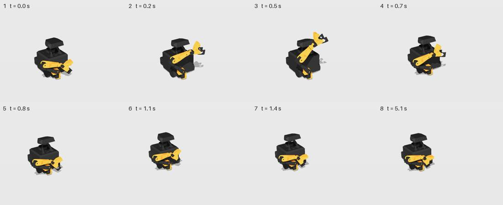
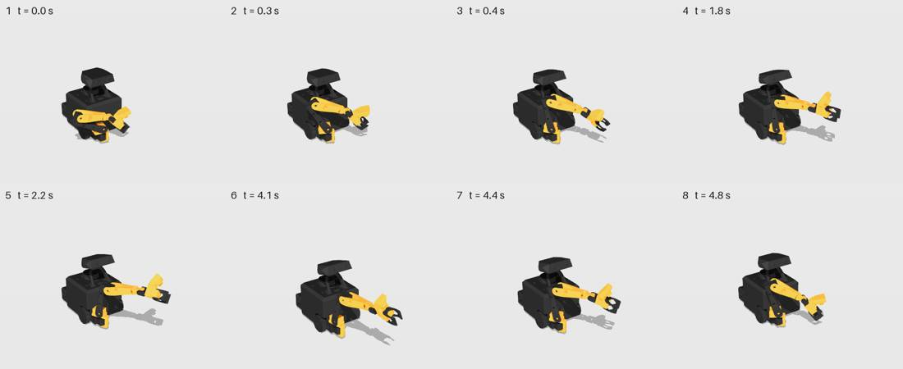
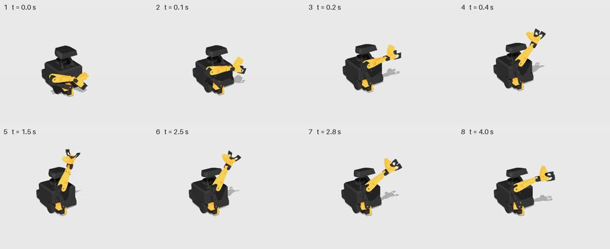
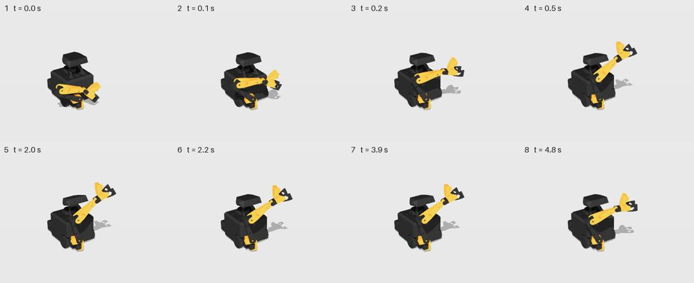
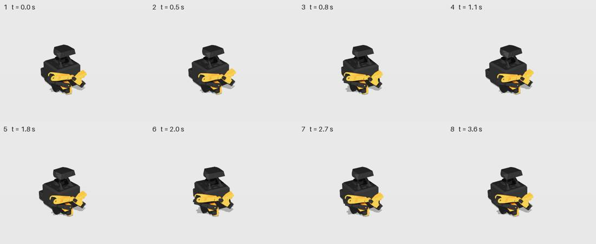
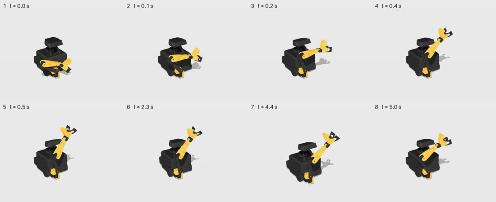

# Blind recognition eval

Every clip is judged blind: the judge sees the motion (Gemini: the physically simulated video; OpenAI: a 2×4 key-frame strip) and never the prompt or recipe. It spreads probability over the studio's 17 labels (`webapp/js/expression/judge.js`), names the motion in its own words, and rates alive / readable 1-5; a text grader then scores each description against the prompt (2 = same feeling or action, 1 = related, 0 = different). `top-1`/`top-3`/`p(target)` count only prompts that have a fitting label; `described`/`named` count every clip. Arms: **lively** = the plan through procedural liveliness (what ships), **direct** = the same plan played as-is (control).

Regenerate: `cd expressive && uv run mars-express eval --judge gemini --n 3` (cached under `out/eval/`).

Core library at `c877d92f6 expressive: validate clips, key the plan tail, osc ends at the pose, no base noise` (clips built 2026-10-03 21:24).

## Judge `gemini-gemini-3.1-pro-preview`

| prompts | arm | clips | top-1 | top-3 | p(target) | described ≥ related | named exactly | alive 1-5 | readable 1-5 |
|---|---|---|---|---|---|---|---|---|---|
| hand-written preset recipes | lively | 16 | 0% | 38% | 11% | 38% | 10% | 2.62 | 3.83 |
| hand-written preset recipes | direct | 16 | 15% | 31% | 12% | 48% | 12% | 2.50 | 3.71 |
| planner on the preset prompts | lively | 16 | 15% | 54% | 14% | 33% | 15% | 2.40 | 3.94 |
| planner on the preset prompts | direct | 16 | 8% | 23% | 11% | 42% | 10% | 2.31 | 3.67 |
| planner on 30 held-out prompts | lively | 30 | 11% | 26% | 11% | 42% | 2% | 2.61 | 3.91 |
| planner on 30 held-out prompts | direct | 30 | 11% | 41% | 16% | 37% | 2% | 2.61 | 4.00 |

A/B (lively vs direct, which moves more like a living creature; order randomised):

| prompts | verdicts | lively wins | clear lively wins | clear direct wins | first-shown wins |
|---|---|---|---|---|---|
| hand-written preset recipes | 48 | 31% | 31% | 67% | 31% |
| planner on the preset prompts | 48 | 48% | 48% | 52% | 12% |
| planner on 30 held-out prompts | 90 | 52% | 51% | 48% | 24% |
| **all** | 186 | 46% | 45% | 54% | 23% |

### Clearest reads

**llm-scared** (lively) — prompt: *scared. Something big is coming at you.*  
judges said: “startled flinch and cower”; “cowering in fear”; “mechanically folding arm to rest”  
labels: startled 0.35, scared 0.30, neutral 0.27 · expected scared · grades [2, 2, 0] · alive 2.7 · readable 4.0

**preset-curious** (lively) — prompt: *curious. Something new caught your eye.*  
judges said: “startled and reacting to something”; “Startled and reaching out”; “suddenly noticing and reaching for something”  
labels: startled 0.48, curious 0.28, scared 0.10 · expected curious · grades [1, 1, 2] · alive 3.0 · readable 4.0

**llm-surprised** (lively) — prompt: *surprised. That came out of nowhere.*  
judges said: “excited and happy”; “having a sudden idea”; “startled by something above”  
labels: excited 0.30, startled 0.27, happy 0.18 · expected startled · grades [1, 1, 2] · alive 3.0 · readable 4.0

### Worst reads

**preset-happy** (lively) — prompt: *happy. Something lovely just happened.*  
judges said: “startled and freezing”; “startled and flinching backward”; “startled and pulling back”  
labels: startled 0.63, scared 0.22, excited 0.05 · expected happy · grades [0, 0, 0] · alive 2.7 · readable 4.3

**preset-angry** (lively) — prompt: *angry. You have had enough.*  
judges said: “excitedly reaching out for something”; “proudly presenting something”; “startled and flinching defensively”  
labels: startled 0.23, excited 0.22, proud 0.15 · expected angry · grades [0, 0, 0] · alive 3.0 · readable 4.0

**preset-agreeing** (lively) — prompt: *nodding yes. You agree.*  
judges said: “proudly presenting or offering something”; “pointing at the floor”; “reaching forward and retracting”  
labels: neutral 0.47, proud 0.17, calm 0.13 · expected (none: description only) · grades [0, 0, 0] · alive 1.3 · readable 2.7

**preset-disagreeing** (lively) — prompt: *shaking your head no. You refuse.*  
judges said: “nodding enthusiastically in agreement”; “startled and scared”; “repeatedly startled and flinching”  
labels: startled 0.47, scared 0.20, happy 0.13 · expected (none: description only) · grades [0, 0, 0] · alive 3.3 · readable 4.7

## Judge `openai-gpt-5.5`

| prompts | arm | clips | top-1 | top-3 | p(target) | described ≥ related | named exactly | alive 1-5 | readable 1-5 |
|---|---|---|---|---|---|---|---|---|---|
| hand-written preset recipes | lively | 16 | 23% | 38% | 12% | 58% | 21% | 2.90 | 3.44 |
| hand-written preset recipes | direct | 16 | 15% | 23% | 11% | 58% | 17% | 2.81 | 3.35 |
| planner on the preset prompts | lively | 16 | 15% | 38% | 10% | 50% | 19% | 2.96 | 3.54 |
| planner on the preset prompts | direct | 16 | 8% | 15% | 9% | 50% | 6% | 2.96 | 3.46 |
| planner on 30 held-out prompts | lively | 30 | 26% | 52% | 17% | 77% | 2% | 3.04 | 3.47 |
| planner on 30 held-out prompts | direct | 30 | 30% | 59% | 18% | 61% | 4% | 3.07 | 3.49 |

A/B (lively vs direct, which moves more like a living creature; order randomised):

| prompts | verdicts | lively wins | clear lively wins | clear direct wins | first-shown wins |
|---|---|---|---|---|---|
| hand-written preset recipes | 48 | 62% | 0% | 4% | 46% |
| planner on the preset prompts | 48 | 50% | 10% | 0% | 48% |
| planner on 30 held-out prompts | 90 | 56% | 3% | 9% | 63% |
| **all** | 186 | 56% | 4% | 5% | 55% |

### Clearest reads

**llm-curious** (lively) — prompt: *curious. Something new caught your eye.*  
judges said: “curious reaching out”; “curious reaching out”; “curious reaching out”  
labels: curious 0.36, neutral 0.16, calm 0.13 · expected curious · grades [2, 2, 2] · alive 3.0 · readable 3.7

**preset-curious** (lively) — prompt: *curious. Something new caught your eye.*  
judges said: “curiously reaching out”; “curious tentative reach”; “curious little wave”  
labels: curious 0.31, neutral 0.10, playful 0.10 · expected curious · grades [2, 2, 2] · alive 3.0 · readable 3.7

**preset-excited** (lively) — prompt: *excited. You can hardly wait.*  
judges said: “excited claw raise”; “excited raised-claw greeting”; “excited upward wave”  
labels: excited 0.29, happy 0.15, proud 0.10 · expected excited · grades [2, 2, 2] · alive 3.0 · readable 4.0

### Worst reads

**preset-agreeing** (lively) — prompt: *nodding yes. You agree.*  
judges said: “curious tentative reaching”; “cautious curious inspection”; “cautiously reaching out”  
labels: curious 0.34, confused 0.15, calm 0.13 · expected (none: description only) · grades [0, 0, 0] · alive 3.0 · readable 3.0

**preset-disagreeing** (lively) — prompt: *shaking your head no. You refuse.*  
judges said: “tentative gripper testing”; “calm idle fidgeting”; “tentatively inspecting something”  
labels: curious 0.24, confused 0.16, calm 0.16 · expected (none: description only) · grades [0, 0, 0] · alive 3.0 · readable 3.0

**llm-agreeing** (lively) — prompt: *nodding yes. You agree.*  
judges said: “curious open-handed reach”; “curiously reaching out”; “cautiously reaching out”  
labels: curious 0.32, neutral 0.15, calm 0.14 · expected (none: description only) · grades [0, 0, 0] · alive 3.0 · readable 3.3

**llm-disagreeing** (lively) — prompt: *shaking your head no. You refuse.*  
judges said: “tentative raised-arm greeting”; “Tentative little greeting”; “curious reach and hold”  
labels: curious 0.22, happy 0.12, playful 0.11 · expected (none: description only) · grades [0, 0, 0] · alive 3.0 · readable 3.3

## What the body does

What each hand-written preset does to the body (lively arm, kinematic): how far the gripper travels from where it starts (base motion removed), the gripper's height range, and the head and base ranges.

| preset | gripper travel | gripper height | head | base turn | base travel |
|---|---|---|---|---|---|
| happy | 34 cm | 4-38 cm | +0..+17° | 0° | 0 cm |
| sad | 5 cm | 3-5 cm | -20..+0° | 8° | 5 cm |
| curious | 30 cm | 5-27 cm | +0..+15° | 0° | 11 cm |
| excited | 39 cm | 5-44 cm | -0..+20° | 12° | 9 cm |
| proud | 40 cm | 5-44 cm | +0..+12° | 16° | 0 cm |
| confused | 29 cm | 4-29 cm | -0..+8° | 20° | 0 cm |
| surprised | 40 cm | 4-45 cm | -1..+16° | 0° | 7 cm |
| scared | 5 cm | 3-6 cm | -5..+9° | 16° | 18 cm |
| angry | 34 cm | 5-33 cm | -9..+4° | 0° | 11 cm |
| sleepy | 4 cm | 3-5 cm | -20..+0° | 0° | 0 cm |
| agreeing | 10 cm | 4-9 cm | +0..+13° | 0° | 0 cm |
| disagreeing | 3 cm | 4-7 cm | -0..+4° | 16° | 0 cm |
| thinking | 27 cm | 4-31 cm | -0..+11° | 11° | 0 cm |
| affectionate | 25 cm | 5-18 cm | +0..+13° | 0° | 8 cm |
| bored | 5 cm | 4-4 cm | -8..+1° | 34° | 0 cm |
| relieved | 27 cm | 4-30 cm | -9..+11° | 0° | 0 cm |

Every lively clip split by whether the arm leaves the fold (gripper travel ≥ 10 cm); `gesture words` = share of blind descriptions saying reach / point / present / raise / wave / show:

| judge | arm motion | clips | p(target) | described ≥ related | alive | gesture words |
|---|---|---|---|---|---|---|
| gemini-gemini-3.1-pro-preview | stays folded | 13 | 7% | 44% | 2.64 | 10% |
| gemini-gemini-3.1-pro-preview | unfolds | 49 | 13% | 37% | 2.54 | 50% |
| openai-gpt-5.5 | stays folded | 13 | 10% | 56% | 2.74 | 15% |
| openai-gpt-5.5 | unfolds | 49 | 15% | 67% | 3.05 | 93% |

## Planner

Planner: `gpt-6-astra` through `planner.write` (frozen prompt, checker, up to 2 repairs), 190 writes (46 eval prompts + 144 probe samples).

| first-pass valid | valid after 1 repair | after 2 repairs | no valid recipe | call latency median / p90 / max | write latency median / p90 |
|---|---|---|---|---|---|
| 100% | 0% | 0% | 0% | 4.9 / 8.1 / 11.2 s | 4.9 / 8.1 s |

Physical probe suite (`brain_client.expressive.probes`), 18 probes × 8 samples: **97%** overall, 100% on the out-of-distribution core, 94% on the rest (the hand-written TEACHER recipes score 100%).

| probe | pass | checks |
|---|---|---|
| sneezing | 100% | release: gaze DOWN + arm snaps forward |
| a big sneeze is coming | 100% | release: gaze DOWN + arm snaps forward |
| startled | 100% | jolt up/back, alert |
| bowing deeply | 100% | gaze down + low, then back up |
| nodding yes | 100% | >= 2 attend oscillations |
| shaking your head no | 62% | >= 2 orient oscillations (the base is MARS's head turn) |
| looking up at the stars | 100% | gaze up >= 40% of the time |
| cowering in fear | 100% | low AND contracted, sustained |
| heartbroken | 100% | low AND gaze down, sustained |
| ecstatic | 100% | tall, open, high energy |
| sleepy toddler | 100% | droops AND recovers at least once |
| drunk | 100% | big askew wobble, >= 5 s |
| a cat stalking prey | 100% | low, >= 1 s still, creeps forward |
| jumping for joy | 88% | big rise change, high energy |
| yawning widely | 88% | mouth wide with gaze up, then droop |
| checking both ways | 100% | turns both ways |
| look at the person | 100% | gaze rises onto the face and stays |
| step back in fear | 100% | the base backs away |

## Reading the failures (by hand, from the videos and strips)

**Headline.** Blind, the motion mostly does not read as its prompt. With 17 labels (chance:
top-1 6 %, top-3 18 %), the shipped arm (lively) on the 16 hand-written presets scores top-1 0 % /
top-3 38 % / p(target) 11 % with the Gemini judge that watches the video, and 23 % / 38 % / 12 % with
the GPT-5.5 judge that reads the strip; 38 % / 58 % of their free-text descriptions are at least
related to the prompt. The planner's recipes do neither better nor worse than the hand-written ones (top-3,
Gemini / GPT-5.5: 54 % / 38 % on the preset prompts, 26 % / 52 % on the 30 held-out ones). The judges are not unsure:
they rate readability 3.4-4.0 / 5. They confidently read something else, and what they read is
the shape of the arm.

**1. The body has two silhouettes, and the judges name both by their shape.** Every positive feeling
(happy, proud, excited, surprised, curious, angry, thinking, affectionate, relieved) swings the gripper
25-40 cm out of the fold to a raised diagonal 30-45 cm high; every negative or low-energy one (sad,
sleepy, scared, bored, disagreeing) leaves it within 5 cm of the fold (the body table above). The plan
channels are distinct (rise = a mast, expand = out to the side and open, approach = toward the person),
but they share one unfolding through READY, so from 1.5 m their end poses are the same raised yellow arm.
Blind judges call it what it looks like: reaching, pointing, presenting, raising a hand
(50 % of Gemini's and 93 % of GPT-5.5's descriptions of unfolding clips say reach, point, present,
raise or wave, against 10 % and 15 % for folded ones). GPT-5.5 calls nearly every unfolding clip a wave:
angry is "a cheerful little wave", thinking "a tentative greeting wave", relieved "a quick friendly
wave", surprised "a proud victory salute". Gemini sees the speed of the unfolding and calls it a
startle: happy is "startled and flinching backward" three times out of three (a 0.4 s snap to the
raised diagonal, then a hold: the bounce and sway that should make it happy are `osc` at 0.5 and
0.75 s, which point 3 strips out), relieved is "startled and recoiling", and angry is "proudly
presenting something" (the two biting lunges are a few centimetres of a straight arm; the gripper
bite is invisible at this distance).

**2. The negative ends are nearly invisible.** NEUTRAL is already the tightest fold, so approach −1,
expand −1 and rise −1 can only squeeze it by a few centimetres; what is left to see is a 20° dip of a
small dark head and the base. Scared (recoil, shrink, back away 18 cm, turn 18°, tremble at E 8) is
read as "slumping in disappointment" and "sad and looking down"; sleepy as "inactive or turned off";
disagreeing (the whole-body head shake) as "repeatedly startled and flinching" or even "nodding
enthusiastically in agreement": its ±14° base shake reaches ±8° (point 3) with the arm folded, so it
is a twitch. A face-less body needs its slump and its recoil on the arm: a
visibly lowered folded arm (the elbow dropping toward the floor, the claw turned down), a recoil that
pulls the folded arm back from the person, and more of the base (backing away and turning away are
the clearest negative cues MARS has).

**3. Fast oscillations are filtered out before they reach the body (core).** The serving plan keys
every 0.25 s after a 2 Hz zero-phase low-pass, so an `osc` keeps 9 % of its amplitude at a 0.3 s
period (the minimum the DSL and the frozen prompt allow), 23 % at 0.4 s, 61 % at 0.6 s and 83 % at
0.8 s (written ±20° → plan ±1.8 / 4.6 / 12.2 / 16.7°). 55 of the planner's 81 `osc` segments in
this eval are faster than 0.7 s (35 faster than 0.5 s), and so are the presets' bounces, chatters,
nods and head shakes (happy `osc z .2 .5`, excited `osc z .25 .45` and `osc g .3 .4`, agreeing
`osc p .35 .6`, disagreeing `osc b 14 .6`). Either play the expanded recipe densely on the
procedural path (only the learned generator needs the sparse plan) or raise the osc floor.

**4. Snaps are halved by the speed limits.** `basis.json` caps the arm at 6 / 3.6 / 4.8 / 2.4 /
2.4 rad/s (j1-j5), and a full unfolding moves j3 by ~3 rad, so a 0.15 s snap takes ≥ 0.6 s: the
held-out sneeze commands 12.8 rad/s at its release and lags the plan by 0.81 rad. Both judges read
that sneeze as "a big sleepy stretch" (the build-up rises and opens like a yawn, and the release is
a swing, not a jolt), although its recipe passes the sneeze probe. The probes check the plan, not
the body: they cannot see this.

**5. Liveliness does not read as more alive, at least not measurably.** Lively against direct wins
46 % of 186 Gemini verdicts (31 % on the hand-written presets) and 56 % of 186 GPT-5.5 verdicts (91 %
of them "slight"). The alive ratings are flat (Gemini 2.62 against 2.50 on the presets, GPT-5.5 2.90
against 2.81). The pairwise judge is dominated by presentation order: Gemini picks the second video
77 % of the time, and only 22 of 62 pairs are unanimous across its three calls. Its reasons credit
"overshoot and settle" and "follow-through" to whichever clip it picks. Both arms play through the
sim's servos, which lag and settle on their own, and the liveliness detail (2-4 % overshoot, noise
scaled by E) is small next to that, and next to the 1.5 m camera. The harness now runs every pair in
both orders and counts a win only when both orders agree. The single-order numbers above predate that
change; in a 2-pair smoke of the new A/B, Gemini picked the second-shown video both times in both rounds.

**6. Speech sway is real but small.** Offline (`demo/idle_speech.yaml` through one Animator), the
head moves over 4.2° while speaking against 1.4° while breathing, its p95 speed is 17.8°/s against
5.1°/s, and the wrist roll 0.18 against 0.12 rad; the base never moves. On the live stack the head is
commanded in whole degrees, so the sway shows up as 1-2° steps. Visible in the demo video, too subtle
for a still.

## The live stack (the demo show through rosbridge, sim, 2026-10-03)

- **Tag bug, fixed.** On 1050c2da2, `<emote>…</emote>` lines on `/brain/tts` were spoken tag and
  all and played nothing: `_on_tts` went straight to `chat.emit`, around the speech streamer's
  `split_emotes`. Fixed in 3251ea373; on the fixed brain all 11 tagged lines played, the transcript
  and the audio clean.
- **Latency.** The generated clip starts 1.8-2.5 s after the line is published (median 2.05 s; the
  brain-LLM link of the chain, the 5090 server was down); the TTS audio arrives 0.6-2.5 s after it.
  The gesture lands mid-sentence, and a timed beat cannot land: the sneeze's release came ~2.5 s
  after the spoken "CHOO!". The offline show lines it up (`sync: release`) because there the clip
  exists before the line starts.
- **The stand-in is usually wrong.** The instant preset that covers those 2 s was `curious` for 8 of
  the 11 prompts (`presets.match` falls back to `DEFAULT = "curious"` when no keyword hits, and emote
  prompts are written in body language, not emotion words), and `sad` for "attend: gaze up, gaze
  down" (the word "down"). Most emotes therefore open with a curious head-cock and lean.
- Evidence: one rosbridge connection per run recording `/joint_states` (28 Hz), `/brain/express/state`,
  `/mars/arm/commands` (2557 commands), `/mars/head/set_position` (920), `/cmd_vel` (2132),
  `/brain/chat_out` and `/tts/audio` over the 109 s show; per-beat joint ranges up to 2.8 rad (j3),
  head −20..+20°, base turns up to 0.6 rad/s; untagged lines move only by speech sway (arm ≤ 0.12 rad,
  head 0..2°).

## The planner and the probes

- `gpt-6-astra` wrote 190 / 190 valid recipes on the first try (no repairs; the DSL's osc aliases
  absorb the gesture-word slips the ml teacher hit), 4.9 s median per call (p90 8.1, max 11.2 s). The
  probe suite passes 97 % (18 probes × 8 samples; out-of-distribution core 100 %, the rest 94 %; the
  hand-written TEACHER recipes 100 %).
- **Probe bug (core).** `probes._half_cycles` detrends with a running mean of `len(x) // 10` frames,
  so the window grows with the clip, and a left-right-left-right shake makes at most 3 sign changes
  where the check needs 4. Two clean ±18° shakes on 0.3 s legs score 2 half-cycles with a 1 s hold
  after them and 0 without it (the 3-frame window of a 1.5 s clip detrends the shake away). All 3
  "shaking your head no" failures are this. Count extrema around the clip's median with hysteresis
  instead.
- The other misses: "jumping for joy" peaked at E 4 (the probe wants ≥ 5), and in "yawning" the gaze
  sits at exactly p .2 when the mouth is widest.

## What to change, in order

1. **Basis (biggest lever):** give the negative ends visible arm motion (a dropped elbow and a downturned claw for
   rise −1, the folded arm pulled back for approach −1), and separate the positive ends' silhouettes:
   the mast straight up, expand out to the side, approach low and forward toward the person. It is
   data in `basis.json`: retune with `mars-express sheet`, then re-run this eval (stale clips and
   their judgments are invalidated automatically).
2. **Plan and limits:** carry `osc` periods ≥ 0.3 s to the body (point 3), and either allow faster
   snaps on the joints that carry them or teach the planner the real minimum (point 4).
3. **Driver:** no `curious` stand-in by default, and generate a reply's emote before its sentence is
   spoken (or hold the line until the clip is ready) when timing matters.
4. **Probes:** fix `_half_cycles`.
5. **Eval:** add the person's-eye (`front`) view to the judge's input once the basis changes; the
   head's ±20° reads better from eye height than from the three-quarter view's 25° above.
