# Blind recognition eval

Every clip is judged blind: the judge sees the motion (Gemini: the physically simulated video; OpenAI: a 2×4 key-frame strip) and never the prompt or recipe. It spreads probability over the studio's 17 labels (`webapp/js/expression/judge.js`), names the motion in its own words, and rates alive / readable 1-5; a text grader then scores each description against the prompt (2 = same feeling or action, 1 = related, 0 = different). `top-1`/`top-3`/`p(target)` count only prompts that have a fitting label; `described`/`named` count every clip. Arms: **lively** = procedural liveliness on the expanded recipe (what ships), **direct** = the recipe played as written (control), **flow** = the ml workstream's flow-matching generator on the serving plan.

Regenerate (per judge, cached under `out/eval/`): `cd expressive && uv run --extra flow mars-express eval --judge gemini --n 3 --flow out/models/generator.pt --pair flow,lively --pair lively,direct`.

Core library at `10d0232cc expressive: basis v6 and presets tuned against the blind judge; osc and snaps reach the body` (clips built 2026-10-04 00:32).

## Judge `gemini-gemini-3.1-pro-preview`

| prompts | arm | clips | top-1 | top-3 | p(target) | described ≥ related | named exactly | alive 1-5 | readable 1-5 |
|---|---|---|---|---|---|---|---|---|---|
| hand-written preset recipes | lively | 17 | 7% | 36% | 11% | 45% | 12% | 2.47 | 3.71 |
| hand-written preset recipes | direct | 17 | 14% | 36% | 10% | 31% | 4% | 2.57 | 3.65 |
| hand-written preset recipes | flow | 17 | 29% | 57% | 17% | 37% | 22% | 2.49 | 4.06 |
| planner on the preset prompts | lively | 17 | 7% | 36% | 11% | 43% | 6% | 2.43 | 3.73 |
| planner on the preset prompts | direct | 17 | 7% | 14% | 8% | 27% | 6% | 2.37 | 3.76 |
| planner on the preset prompts | flow | 17 | 29% | 50% | 17% | 45% | 18% | 2.41 | 3.76 |
| planner on 30 held-out prompts | lively | 30 | 19% | 44% | 18% | 46% | 3% | 2.68 | 3.96 |
| planner on 30 held-out prompts | direct | 30 | 19% | 44% | 15% | 39% | 4% | 2.58 | 3.84 |
| planner on 30 held-out prompts | flow | 30 | 11% | 48% | 17% | 43% | 3% | 2.63 | 3.92 |

A/B flow vs lively: which moves more like a living creature. Every round shows the pair in both orders; a win counts only when both orders agree, otherwise the round is position-biased.

| prompts | rounds | flow wins | lively wins | position-biased (first / second shown won both) | flow share of agreed |
|---|---|---|---|---|---|
| hand-written preset recipes | 51 | 7 | 1 | 2 / 41 | 88% |
| planner on the preset prompts | 51 | 7 | 4 | 0 / 40 | 64% |
| planner on 30 held-out prompts | 90 | 20 | 7 | 5 / 58 | 74% |
| **all** | 192 | 34 | 12 | 7 / 139 | 74% |

A/B lively vs direct: which moves more like a living creature. Every round shows the pair in both orders; a win counts only when both orders agree, otherwise the round is position-biased.

| prompts | rounds | lively wins | direct wins | position-biased (first / second shown won both) | lively share of agreed |
|---|---|---|---|---|---|
| hand-written preset recipes | 51 | 12 | 2 | 1 / 36 | 86% |
| planner on the preset prompts | 51 | 7 | 5 | 4 / 35 | 58% |
| planner on 30 held-out prompts | 90 | 15 | 25 | 8 / 42 | 38% |
| **all** | 192 | 34 | 32 | 13 / 113 | 52% |

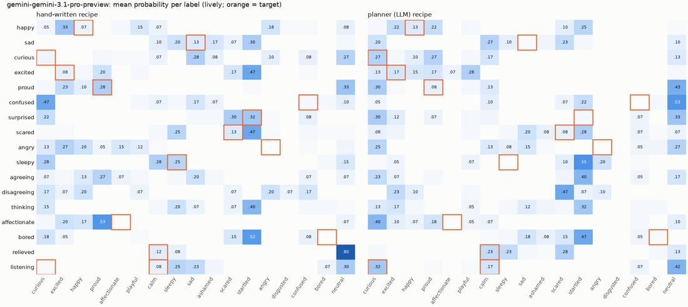

### Clearest reads

**preset-proud** (lively) — prompt: *proud. You finally solved it.*  
judges said: “proudly presenting something”; “throwing arm up in excitement”; “reaching up and freezing”  
labels: neutral 0.33, proud 0.28, excited 0.23 · expected proud · grades [2, 2, 1] · alive 1.3 · readable 3.0

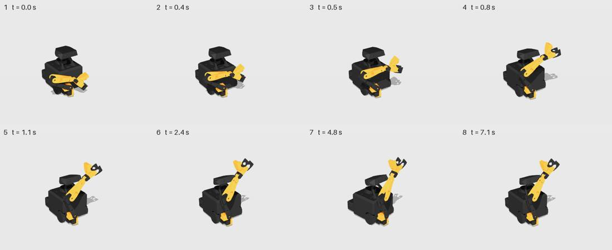

**ood-rock-star** (lively) — prompt: *a rock star soaking up the applause after the encore.*  
judges said: “excitedly cheering and showing off”; “eagerly raising hand for attention”; “excitedly cheering with raised arm”  
labels: excited 0.60, happy 0.18, playful 0.12 · expected proud, excited · grades [1, 1, 1] · alive 3.0 · readable 4.0

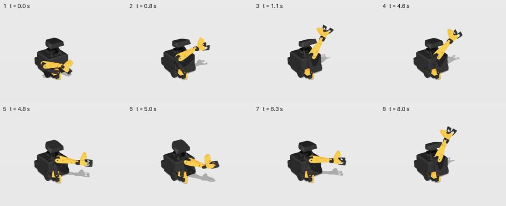

**preset-surprised** (lively) — prompt: *surprised. That came out of nowhere.*  
judges said: “cowering and looking up in fear”; “curiously looking up”; “startled and recoiling”  
labels: startled 0.32, scared 0.30, curious 0.22 · expected startled · grades [1, 1, 2] · alive 3.3 · readable 4.3

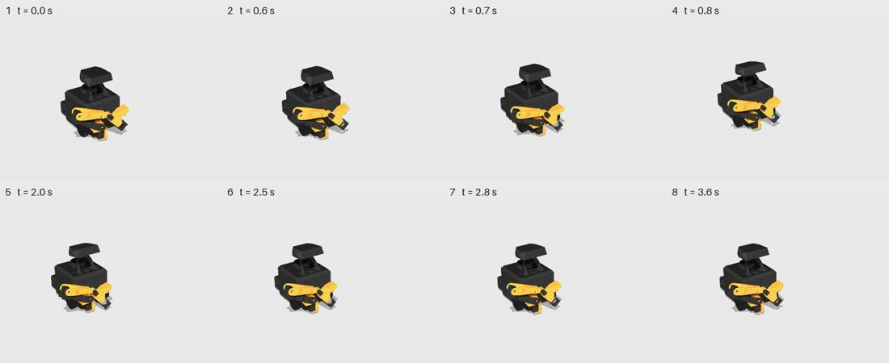

### Worst reads

**preset-angry** (lively) — prompt: *angry. You have had enough.*  
judges said: “happily reaching out for a hug”; “reaching out to offer or ask”; “excitedly waving or reaching out”  
labels: excited 0.27, happy 0.20, affectionate 0.15 · expected angry · grades [0, 0, 0] · alive 3.3 · readable 4.0

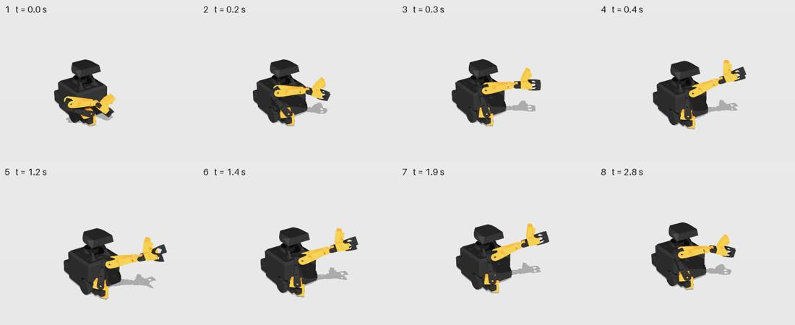

**preset-agreeing** (lively) — prompt: *nodding yes. You agree.*  
judges said: “presenting something”; “proudly presenting something”; “reaching out then drooping sadly”  
labels: proud 0.27, sad 0.20, happy 0.13 · expected (none: description only) · grades [0, 0, 0] · alive 2.7 · readable 3.3

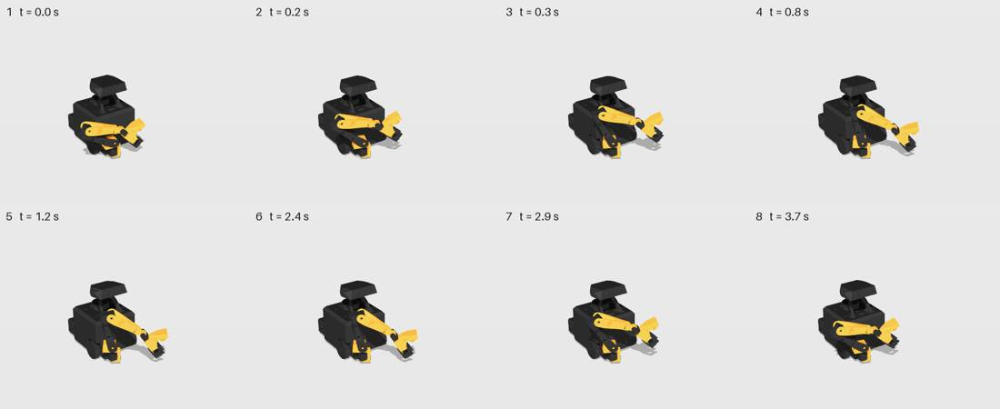

**preset-bored** (lively) — prompt: *bored. Nothing is happening.*  
judges said: “startled and recoiling”; “suddenly startled and recoiling”; “curiously looking up and reaching”  
labels: startled 0.52, curious 0.18, scared 0.15 · expected bored · grades [0, 0, 0] · alive 3.3 · readable 4.7

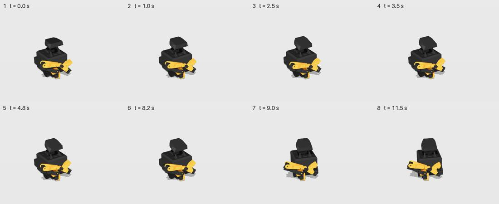

**llm-agreeing** (lively) — prompt: *nodding yes. You agree.*  
judges said: “pointing at something”; “startled and frozen”; “noticing something to the side”  
labels: startled 0.40, curious 0.23, neutral 0.17 · expected (none: description only) · grades [0, 0, 0] · alive 1.7 · readable 4.0

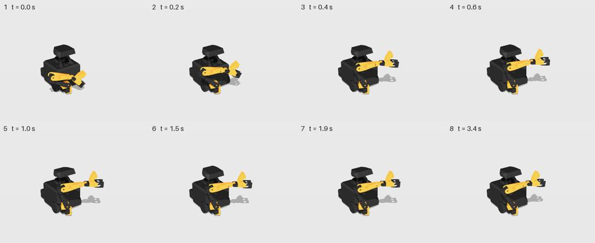

## Judge `gemini-gemini-3.1-pro-preview` · camera `human`

| prompts | arm | clips | top-1 | top-3 | p(target) | described ≥ related | named exactly | alive 1-5 | readable 1-5 |
|---|---|---|---|---|---|---|---|---|---|
| hand-written preset recipes | lively | 17 | 14% | 14% | 11% | 47% | 12% | 2.24 | 3.43 |
| hand-written preset recipes | flow | 17 | 7% | 21% | 8% | 43% | 8% | 2.22 | 3.43 |

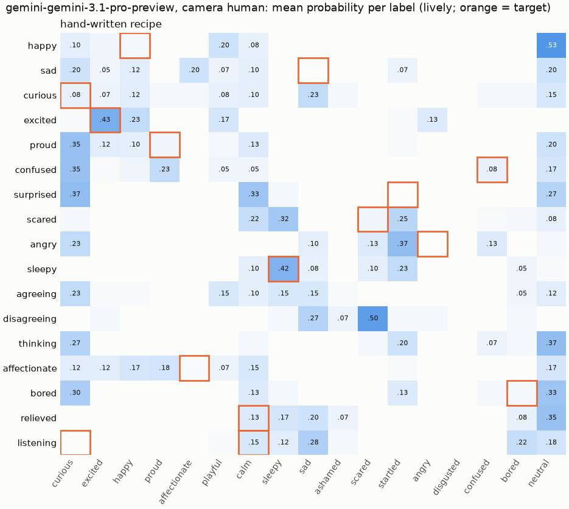

### Clearest reads

**preset-excited** (lively) — prompt: *excited. You can hardly wait.*  
judges said: “excitedly barking or snapping”; “cheering and clapping excitedly”; “excitedly waving to get attention”  
labels: excited 0.43, happy 0.23, playful 0.17 · expected excited · grades [2, 2, 2] · alive 3.3 · readable 4.0

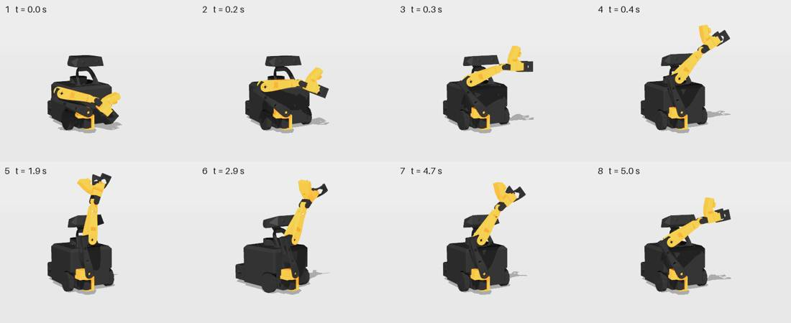

**preset-sleepy** (lively) — prompt: *sleepy. You keep nodding off.*  
judges said: “falling asleep”; “waking up slowly”; “startled and scared”  
labels: sleepy 0.42, startled 0.23, calm 0.10 · expected sleepy · grades [2, 1, 0] · alive 3.0 · readable 4.3

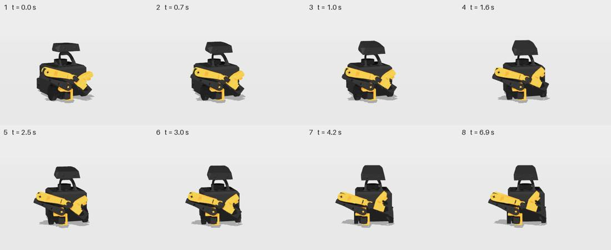

**preset-affectionate** (lively) — prompt: *affectionate. You are happy to see a friend.*  
judges said: “reaching up calmly”; “proudly presenting or reaching up”; “friendly greeting or wave”  
labels: proud 0.18, neutral 0.17, happy 0.17 · expected affectionate · grades [1, 1, 2] · alive 2.0 · readable 3.0

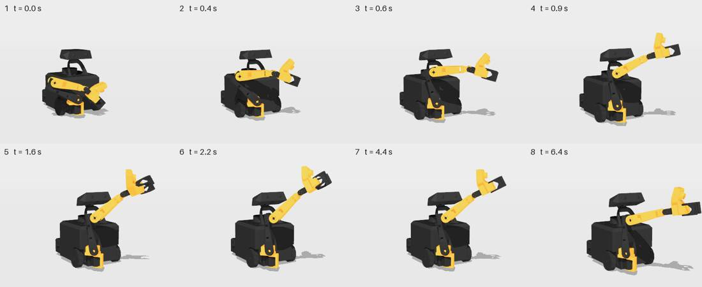

### Worst reads

**preset-bored** (lively) — prompt: *bored. Nothing is happening.*  
judges said: “suddenly noticing something”; “turning to face a new direction”; “simple mechanical turn”  
labels: neutral 0.33, curious 0.30, calm 0.13 · expected bored · grades [0, 0, 0] · alive 1.7 · readable 3.0

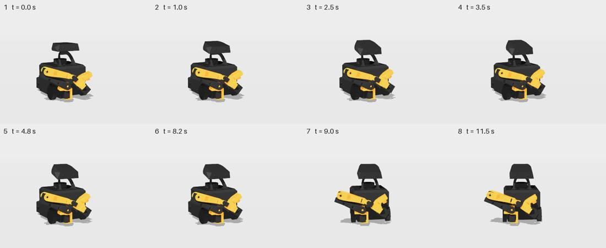

**preset-listening** (lively) — prompt: *listening. Someone is talking to you.*  
judges said: “idly opening and closing claw”; “slowly extending arm and holding”; “feeling sad and drooping”  
labels: sad 0.28, bored 0.22, neutral 0.18 · expected calm, curious · grades [0, 0, 0] · alive 2.0 · readable 3.0

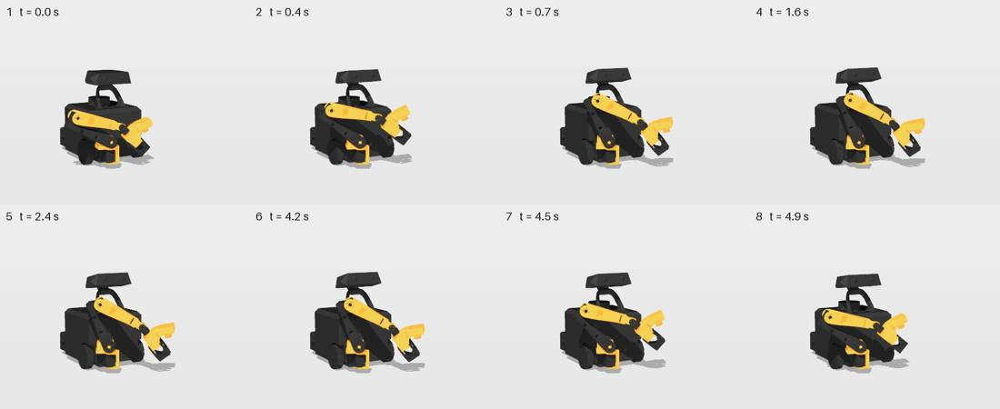

**preset-surprised** (lively) — prompt: *surprised. That came out of nowhere.*  
judges said: “looking up slowly”; “slowly raising head to look”; “calmly looking up or waking”  
labels: curious 0.37, calm 0.33, neutral 0.27 · expected startled · grades [0, 1, 0] · alive 1.7 · readable 3.0

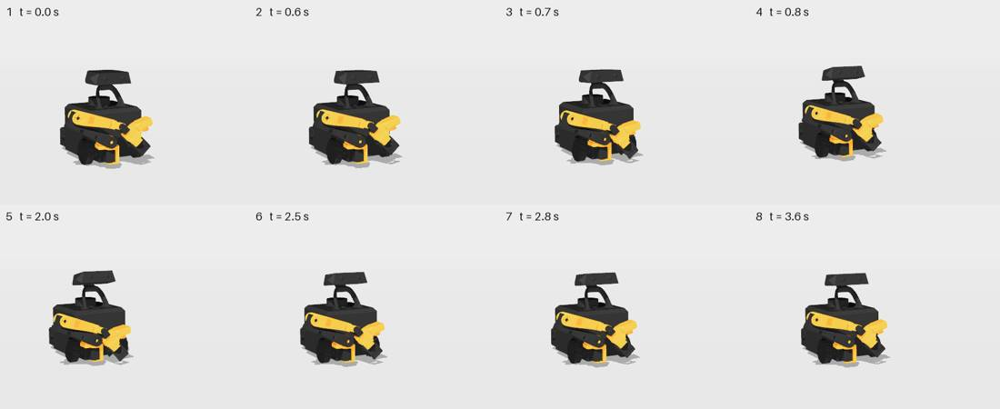

**preset-angry** (lively) — prompt: *angry. You have had enough.*  
judges said: “startled then sad”; “looking around curiously”; “startled then relaxing”  
labels: startled 0.37, curious 0.23, confused 0.13 · expected angry · grades [1, 0, 0] · alive 3.7 · readable 4.0

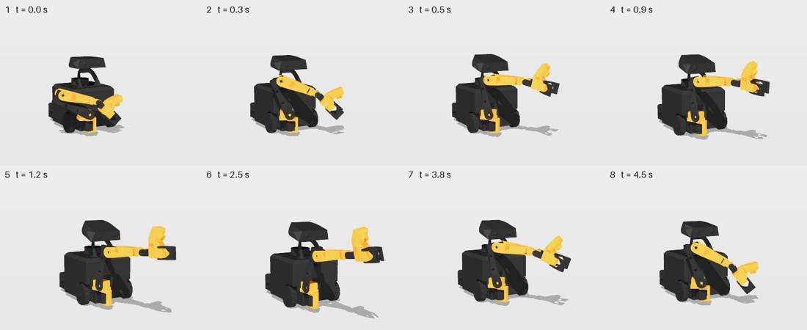

## Judge `openai-gpt-5.5`

| prompts | arm | clips | top-1 | top-3 | p(target) | described ≥ related | named exactly | alive 1-5 | readable 1-5 |
|---|---|---|---|---|---|---|---|---|---|
| hand-written preset recipes | lively | 17 | 43% | 64% | 19% | 73% | 22% | 2.92 | 3.18 |
| hand-written preset recipes | direct | 17 | 14% | 43% | 14% | 57% | 14% | 2.90 | 3.18 |
| hand-written preset recipes | flow | 17 | 21% | 50% | 14% | 59% | 14% | 2.84 | 3.25 |
| planner on the preset prompts | lively | 17 | 21% | 43% | 13% | 55% | 18% | 2.90 | 3.59 |
| planner on the preset prompts | direct | 17 | 21% | 50% | 13% | 53% | 18% | 2.92 | 3.63 |
| planner on the preset prompts | flow | 17 | 14% | 36% | 11% | 51% | 8% | 2.98 | 3.45 |
| planner on 30 held-out prompts | lively | 30 | 30% | 52% | 18% | 72% | 2% | 3.08 | 3.47 |
| planner on 30 held-out prompts | direct | 30 | 22% | 48% | 18% | 71% | 2% | 3.04 | 3.44 |
| planner on 30 held-out prompts | flow | 30 | 22% | 48% | 17% | 68% | 6% | 3.00 | 3.44 |

A/B flow vs lively: which moves more like a living creature. Every round shows the pair in both orders; a win counts only when both orders agree, otherwise the round is position-biased.

| prompts | rounds | flow wins | lively wins | position-biased (first / second shown won both) | flow share of agreed |
|---|---|---|---|---|---|
| hand-written preset recipes | 51 | 17 | 15 | 3 / 16 | 53% |
| planner on the preset prompts | 51 | 26 | 4 | 5 / 16 | 87% |
| planner on 30 held-out prompts | 90 | 30 | 18 | 4 / 38 | 62% |
| **all** | 192 | 73 | 37 | 12 / 70 | 66% |

A/B lively vs direct: which moves more like a living creature. Every round shows the pair in both orders; a win counts only when both orders agree, otherwise the round is position-biased.

| prompts | rounds | lively wins | direct wins | position-biased (first / second shown won both) | lively share of agreed |
|---|---|---|---|---|---|
| hand-written preset recipes | 51 | 15 | 18 | 4 / 14 | 45% |
| planner on the preset prompts | 51 | 17 | 14 | 7 / 13 | 55% |
| planner on 30 held-out prompts | 90 | 20 | 29 | 13 / 28 | 41% |
| **all** | 192 | 52 | 61 | 24 / 55 | 46% |

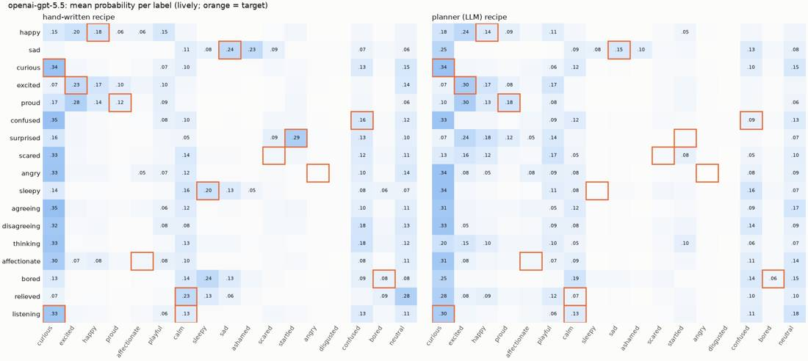

### Clearest reads

**llm-curious** (lively) — prompt: *curious. Something new caught your eye.*  
judges said: “curious reaching out”; “curious reaching out”; “curious reaching out”  
labels: curious 0.34, neutral 0.15, calm 0.12 · expected curious · grades [2, 2, 2] · alive 3.0 · readable 3.7

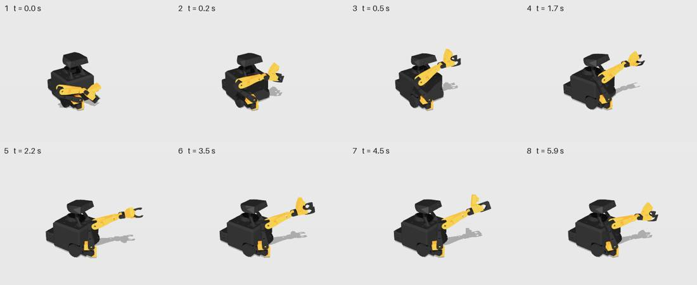

**llm-excited** (lively) — prompt: *excited. You can hardly wait.*  
judges said: “excited one-armed wave”; “excited little wave”; “eager arm wave”  
labels: excited 0.30, happy 0.17, playful 0.17 · expected excited · grades [2, 2, 2] · alive 3.0 · readable 4.0

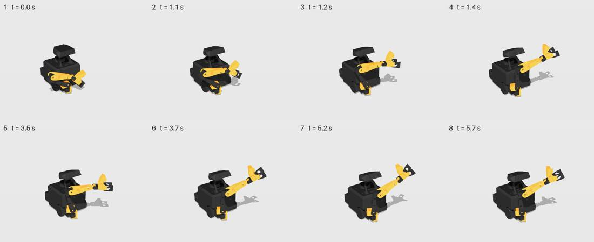

**preset-surprised** (lively) — prompt: *surprised. That came out of nowhere.*  
judges said: “brief startled flinch”; “brief startled flinch”; “brief startled flinch”  
labels: startled 0.29, curious 0.16, confused 0.13 · expected startled · grades [2, 2, 2] · alive 3.0 · readable 3.0

### Worst reads

**preset-agreeing** (lively) — prompt: *nodding yes. You agree.*  
judges said: “tentatively reaching to inspect”; “Tentative curious reach”; “curious reaching out”  
labels: curious 0.35, calm 0.12, neutral 0.11 · expected (none: description only) · grades [0, 0, 0] · alive 3.0 · readable 3.0

**llm-agreeing** (lively) — prompt: *nodding yes. You agree.*  
judges said: “curious reach outward”; “curious reaching out”; “curiously reaching out”  
labels: curious 0.31, neutral 0.17, calm 0.12 · expected (none: description only) · grades [0, 0, 0] · alive 2.7 · readable 3.7

**llm-disagreeing** (lively) — prompt: *shaking your head no. You refuse.*  
judges said: “curious reaching gesture”; “tentative curious reach”; “curious tentative wave”  
labels: curious 0.33, confused 0.14, neutral 0.09 · expected (none: description only) · grades [0, 0, 0] · alive 3.0 · readable 3.0

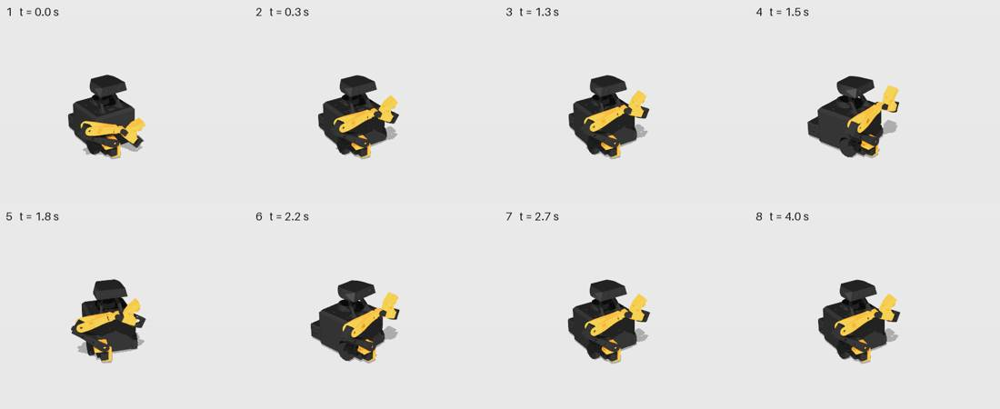

**ood-tickle-sneeze** (lively) — prompt: *your nose tickles more and more until it bursts out in a huge sneeze.*  
judges said: “curious reaching gesture”; “curious reach and retract”; “curious reach and inspect”  
labels: curious 0.33, confused 0.12, playful 0.10 · expected (none: description only) · grades [0, 0, 0] · alive 3.0 · readable 3.0

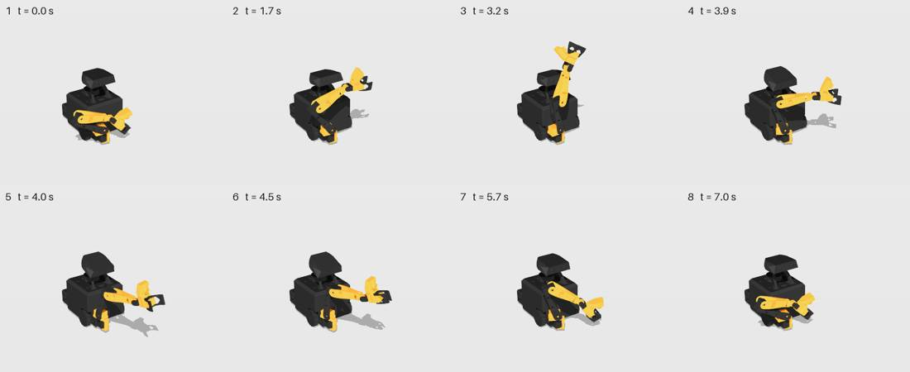

## What the body does

What each hand-written preset does to the body (lively arm, kinematic): how far the gripper travels from where it starts (base motion removed), the gripper's height range, and the head and base ranges.

| preset | gripper travel | gripper height | head | base turn | base travel |
|---|---|---|---|---|---|
| happy | 36 cm | 4-39 cm | +0..+16° | 29° | 0 cm |
| sad | 5 cm | 5-9 cm | -20..+0° | 20° | 6 cm |
| curious | 33 cm | 5-22 cm | +0..+17° | 0° | 9 cm |
| excited | 41 cm | 5-45 cm | -0..+20° | 29° | 0 cm |
| proud | 36 cm | 5-40 cm | -0..+20° | 13° | 6 cm |
| confused | 16 cm | 3-11 cm | +0..+11° | 45° | 0 cm |
| surprised | 4 cm | 2-5 cm | -0..+13° | 0° | 11 cm |
| scared | 9 cm | 3-4 cm | -20..+0° | 46° | 25 cm |
| angry | 34 cm | 4-25 cm | -19..-0° | 0° | 15 cm |
| sleepy | 5 cm | 4-9 cm | -20..+0° | 25° | 0 cm |
| agreeing | 21 cm | 4-16 cm | -6..+12° | 0° | 0 cm |
| disagreeing | 7 cm | 2-6 cm | -7..-0° | 57° | 0 cm |
| thinking | 4 cm | 3-5 cm | -0..+8° | 11° | 0 cm |
| affectionate | 34 cm | 5-36 cm | +0..+20° | 0° | 20 cm |
| bored | 4 cm | 4-6 cm | -20..+0° | 26° | 0 cm |
| relieved | 2 cm | 3-6 cm | -4..+8° | 0° | 0 cm |
| listening | 7 cm | 4-9 cm | -0..+14° | 0° | 0 cm |

Every lively clip split by whether the arm leaves the fold (gripper travel ≥ 10 cm); `gesture words` = share of blind descriptions saying reach / point / present / raise / wave / show:

| judge | arm motion | clips | p(target) | described ≥ related | alive | gesture words |
|---|---|---|---|---|---|---|
| gemini-gemini-3.1-pro-preview | stays folded | 14 | 13% | 50% | 2.60 | 10% |
| gemini-gemini-3.1-pro-preview | unfolds | 50 | 15% | 43% | 2.55 | 57% |
| gemini-gemini-3.1-pro-preview@human | stays folded | 9 | 11% | 41% | 2.07 | 4% |
| gemini-gemini-3.1-pro-preview@human | unfolds | 8 | 10% | 54% | 2.42 | 58% |
| openai-gpt-5.5 | stays folded | 14 | 17% | 76% | 2.86 | 10% |
| openai-gpt-5.5 | unfolds | 50 | 17% | 65% | 3.03 | 93% |

## Planner

Planner: `gpt-6-astra` through `planner.write` (frozen prompt, checker, up to 2 repairs), 191 writes (47 eval prompts + 144 probe samples).

| first-pass valid | valid after 1 repair | after 2 repairs | no valid recipe | call latency median / p90 / max | write latency median / p90 |
|---|---|---|---|---|---|
| 100% | 0% | 0% | 0% | 4.9 / 8.0 / 11.2 s | 4.9 / 8.0 s |

Physical probe suite (`brain_client.expressive.probes`), 18 probes × 8 samples: **99%** overall, 100% on the out-of-distribution core, 98% on the rest (the hand-written TEACHER recipes score 100%).

| probe | pass | checks |
|---|---|---|
| sneezing | 100% | release: gaze DOWN + arm snaps forward |
| a big sneeze is coming | 100% | release: gaze DOWN + arm snaps forward |
| startled | 100% | jolt up/back, alert |
| bowing deeply | 100% | gaze down + low, then back up |
| nodding yes | 100% | >= 2 attend oscillations |
| shaking your head no | 100% | >= 2 orient oscillations (the base is MARS's head turn) |
| looking up at the stars | 100% | gaze up >= 40% of the time |
| cowering in fear | 100% | low AND contracted, sustained |
| heartbroken | 100% | low AND gaze down, sustained |
| ecstatic | 100% | tall, open, high energy |
| sleepy toddler | 100% | droops AND recovers at least once |
| drunk | 100% | big askew wobble, >= 5 s |
| a cat stalking prey | 100% | low, >= 1 s still, creeps forward |
| jumping for joy | 88% | big rise change, high energy |
| yawning widely | 88% | mouth wide with gaze up, then droop |
| checking both ways | 100% | turns both ways |
| look at the person | 100% | gaze rises onto the face and stays |
| step back in fear | 100% | the base backs away |

## Reading the failures (by hand, from the videos and strips)

**Headline (core 10d0232cc, basis v6, retuned presets).** The strip judge now reads the shipped presets
well above chance (17 labels: chance 6 % top-1, 18 % top-3): GPT-5.5 gets top-1 43 % / top-3 64 %, and
73 % of its descriptions are related to the prompt (lively arm). The video judge does not: Gemini 3.1
Pro gets top-1 7 % / top-3 36 %, related 45 %. On the held-out prompts the two judges agree more (top-3
52 % and 44 %, related 72 % and 46 %). The retune helped the strip most because it was tuned against
the strip judge. The planner's recipes for the preset prompts read worse than the hand-tuned ones
(GPT-5.5 top-3 43 % against 64 %).

**1. The video judge reads gaze down as head up.** From the three-quarter camera (1.6 m away,
25° above), a head that tilts down shows more of its flat top, and its silhouette grows. In the 30
Gemini readings of clips whose gaze only goes down (sad, sleepy, scared, bored, angry...), 23 say the
head goes up ("head jerks up abruptly", "snaps head back") and 5 say down. GPT-5.5, reading stills of
the same poses, says down 17 times and up once. So for the video judge every slump becomes a startle:
scared is "startled and freezing in place", bored "startled and recoiling", and angry, head down and
lunging, is "happily reaching out for a hug". The sim's head is not inverted (the physical and
kinematic head angles agree to 0.5°). This is how a standing person sees MARS too, since a person also
looks down on it. The head needs a visible face (eyes or a light on its front) so "down" reads as
hiding the face, and the judge video wants a camera nearer the head's height.

**1b. A head-height camera does not rescue it (measured).** Re-judged with Gemini from a `human`
camera (`--camera human`: eye 0.41 m, 1.5 m away, looking down 8°, 30° off the robot's heading; the
robot fills 46 % folded to 75 % as a mast of the frame height), the 17 presets × lively and flow.
"Head down" for the gaze-down presets rises from 8 to 15 of 30 readings, and "up" falls from 19 to 16:
better, but still a coin toss. Recognition gets worse. Lively top-1 / top-3 / related is
14 / 14 / 47 % (elevated: 7 / 36 / 45 %), flow 7 / 21 / 43 % (elevated: 29 / 57 / 37 %), and alive
drops 2.47 → 2.24. From head height the arm's shapes flatten into the body and "neutral" becomes
the commonest label. The elevated view stays the default. The gaze needs a face on the head, not
a different camera.

**2. Two silhouettes still dominate.** 50 of 64 lively clips swing the gripper ≥ 10 cm out of the fold,
and the judges describe the shape. 93 % (GPT-5.5) and 57 % (Gemini) of their descriptions of those
clips say reach, point, present, raise or wave, against 10 % for clips that stay folded. Angry (a
forward lunge with a bite) and affectionate (a reach toward the person) both read as reaching out.
Agreeing nods the head while approach .4-.55 holds the arm forward, so it reads as "presenting
something". The negative presets now use the base (scared backs away 25 cm and turns 46°;
disagreeing turns 57°), and that is where they score.

**3. The flow generator reads at least as well, and more alive.** On the hand-written presets the
flow arm is the video judge's best (top-3 57 % against lively 36 %) and in the middle for the strip
judge (50 % against 64 %). In the both-orders A/B it beats lively in the rounds where the judge agrees
with itself: GPT-5.5 73 to 37 (66 %), Gemini 34 to 12 (74 %). Its arm motion carries less fast detail
than liveliness (>1 Hz RMS on approach / rise / askew 0.026 / 0.032 / 0.020 against 0.045 / 0.049 /
0.035): smoother arm moves read as more alive.

**4. Liveliness against the bare recipe is a coin toss.** Lively against direct: GPT-5.5 52 to 61,
Gemini 34 to 32. The alive ratings do not separate either (2.92 against 2.90 on the presets, GPT-5.5).
Liveliness does help recognition on the strip (top-1 43 % against 14 % on the presets), probably by
making poses clearer at the moment the frame is taken.

**5. The video judge's A/B is mostly position.** In 139 of Gemini's 192 flow/lively rounds and 113 of
192 lively/direct rounds, the second-shown video won in both orders. GPT-5.5 is position-biased in 82
and 79 rounds. Only the agreed rounds above mean anything. For Gemini that is 24-34 % of the rounds.

**6. Speech sway** is unchanged from the first round: offline, the head moves over 4.2° speaking
against 1.4° breathing, and on the stack it shows as 1-2° steps of the whole-degree head command.

## The live stack (the demo show through rosbridge, sim, 2026-10-03, core c877d92f6)

- `<emote>…</emote>` lines on `/brain/tts` were spoken tag and all until 3251ea373. Afterwards, all 11
  tagged lines played with a clean transcript and clean audio.
- The generated clip starts 1.8-2.5 s after the line is published (median 2.05 s, the brain-LLM
  link of the chain), so gestures land mid-sentence. The instant stand-in was `curious` for 8 of 11
  body-language prompts; `presets.match` has since moved to keyword stems with a `listening` default
  (not re-measured on the stack).

## The planner and the probes

- `gpt-6-astra` wrote 191 / 191 valid recipes on the first try (no repairs), 4.9 s median per call
  (p90 8.0, max 11.2 s). The probe suite passes 99 % (18 probes × 8 samples; out-of-distribution
  core 100 %), with the hysteresis half-cycle count.

## What to change, in order

1. **Give the head a face** (eyes or a light on its front edge). Then "gaze down" hides the face
   instead of growing the head's silhouette, the clearest negative cue MARS has.
2. **Break the reach silhouette:** negative and aggressive feelings need arm shapes that do not unfold
   forward (angry as a raised, cocked claw rather than a lunge; agreeing with the arm folded).
3. **Ship the flow generator** for the planner path. It read as more alive in both judges' agreed
   rounds, and at least as recognisable.
4. **Judge camera:** keep the elevated three-quarter view (the head-height `human` camera reads worse,
   point 1b), and count only agreed A/B rounds.
