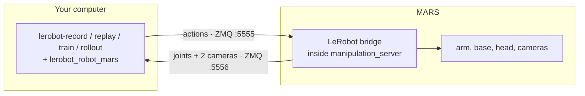

# MARS on LeRobot

`lerobot_robot_mars` makes the [Innate MARS](https://www.innate.bot/) a first-class
[LeRobot](https://github.com/huggingface/lerobot) robot. Record demonstrations, train a policy
with any LeRobot model, and run it on the robot, all with the standard LeRobot commands and
`--robot.type=mars`.

What you get:

- **Record** LeRobotDataset v3 datasets while you drive the robot the way you already do: the
  phone app, the web app's Teleop page, or the leader arm.
- **Replay** recorded episodes on the robot.
- **Train** ACT, Diffusion Policy, SmolVLA, π0 and the rest of the LeRobot policy zoo on your data.
- **Run** a trained policy on the robot with `lerobot-rollout`.
- **Publish** to the Hugging Face Hub, including the datasets you already recorded with innate-os,
  from a button in the web app.

An example dataset recorded this way:
[innate-inc/mars-pick-tv](https://huggingface.co/datasets/innate-inc/mars-pick-tv).

## Contents

- [How it works](#how-it-works)
- [Requirements](#requirements)
- [Setup](#setup)
- [The workflow](#the-workflow): [record](#1-record-a-dataset), [replay](#2-replay-an-episode),
  [train](#3-train-a-policy), [run](#4-run-the-policy-on-the-robot), [publish](#5-publish-to-the-hub)
- [Datasets recorded with innate-os](#datasets-recorded-with-innate-os)
- [Using the simulator](#using-the-simulator)
- [Reference](#reference)
- [Troubleshooting](#troubleshooting)
- [Development](#development)

## How it works



LeRobot runs on your computer and never touches ROS. It talks to a small bridge that ships with
innate-os: actions go in on one socket, joint states and both camera streams come out on the
other. The bridge is on by default and does nothing until a client connects.

The same commands also run on the robot's Jetson itself, in this package's own Python 3.12
environment, with `MARS_HOST=localhost`.

## Requirements

| | |
|---|---|
| **Robot** | MARS on **innate-os 0.8.0 or newer** |
| **Computer** | macOS or Linux, on the same network as the robot |
| **Tools** | [uv](https://docs.astral.sh/uv/getting-started/installation/) and git. uv downloads Python 3.12 for you |
| **For training** | An NVIDIA GPU or Apple Silicon. Not needed for recording or replay |

## Setup

### 1. Update the robot

The bridge ships with innate-os 0.8.0. On the robot:

```bash
innate update apply
```

> [!NOTE]
> 0.8.0 is not released yet. Until it is, update to the latest `main` instead:
> `innate update --dev apply main`

Then check the manipulation server's log, in `innate view` or on the web app's Logging page. You
should see:

```
LeRobot bridge listening on :5555 (actions) and :5556 (observations)
```

### 2. Install on your computer

```bash
git clone https://github.com/innate-inc/innate-os.git
cd innate-os/lerobot
uv sync
```

`uv sync` creates `.venv` with LeRobot, this plugin, and everything the record, viewer and
training commands need. Run every command below from this folder.

### 3. Point it at your robot

Tell your computer where the robot is, once per terminal. The robot's IP address is the most
reliable choice:

```bash
export MARS_HOST=192.168.1.42
```

To find the address, run `hostname -I` on the robot, or `ping mars.local` from your computer.
The hostname you type into the browser for the web app, such as `mars.local`, works too, but
`.local` names do not resolve on every network.

Every command reads `MARS_HOST`. `--robot.remote_ip=…` and `--teleop.remote_ip=…` override it
for a single command.

### 4. Check the connection

```bash
uv run lerobot-teleoperate --robot.type=mars --robot.external_commands=true \
    --teleop.type=mars_passthrough --display_data=true
```

A [Rerun](https://rerun.io/) window opens with both camera streams and live joint plots. Drive
the robot from the phone app or the web app and watch them move. The robot's log says
`LeRobot client connected`. Stop with Ctrl+C.

## The workflow

### 1. Record a dataset

Drive the robot however you normally do: the phone app, the web app's Teleop page, or the leader
arm. LeRobot records what you command, so there is no new teleop hardware to set up.

```bash
uv run lerobot-record \
    --robot.type=mars --robot.external_commands=true --teleop.type=mars_passthrough \
    --dataset.repo_id=YOUR_HF_NAME/mars-tidy-up --dataset.no_stamp=true \
    --dataset.single_task="Put the ball in the box" \
    --dataset.fps=30 --dataset.num_episodes=10 --dataset.push_to_hub=false
```

| Key | During recording |
|---|---|
| Right arrow | End this episode and move on |
| Left arrow | Discard this episode and record it again |
| Escape | Stop and save |

The dataset is saved under `~/.cache/huggingface/lerobot/YOUR_HF_NAME/mars-tidy-up`.

**Add more episodes later** by repeating the command with two extra flags. LeRobot needs the
dataset's folder spelled out to resume, and `num_episodes` then counts this session only:

```bash
    --resume=true --dataset.root=$HOME/.cache/huggingface/lerobot/YOUR_HF_NAME/mars-tidy-up
```

> [!TIP]
> Fifty clean episodes of one task, with the object placed a little differently each time, is a
> good first dataset. The head holds one tilt angle for the whole dataset automatically; see
> [Head angle](#head-angle).

### 2. Replay an episode

A quick way to confirm that what was recorded is what the robot did:

```bash
uv run lerobot-replay --robot.type=mars \
    --dataset.repo_id=YOUR_HF_NAME/mars-tidy-up --dataset.episode=0
```

> [!IMPORTANT]
> Leave teleop first, in the phone app and in the web app. While either one is teleoperating it
> keeps sending its own commands, and those win over LeRobot's. This applies to replay and to
> running a policy.

### 3. Train a policy

Training runs on your computer, not on the robot. ACT is the best first model: it is small,
trains quickly, and works with tens of episodes.

```bash
uv run lerobot-train \
    --dataset.repo_id=YOUR_HF_NAME/mars-tidy-up \
    --policy.type=act --policy.device=cuda \
    --output_dir=outputs/train/act_mars --job_name=act_mars \
    --steps=20000 --batch_size=8 --save_freq=5000 \
    --policy.push_to_hub=false --wandb.enable=false
```

- Use `--policy.device=mps` on Apple Silicon.
- 20 000 steps is a reasonable first pass; LeRobot's default is 100 000. Checkpoints land in
  `outputs/train/act_mars/checkpoints/`, and `last` always points at the newest.
- Out of GPU memory: lower `--batch_size`, and add `--policy.use_amp=true`.
- Training on a different machine: [publish](#5-publish-to-the-hub) the dataset, repeat
  [step 2 of Setup](#2-install-on-your-computer) there, and run the same command. It downloads
  the dataset from the Hub.

Other policies need their libraries first, for example `uv sync --extra smolvla`, then
`--policy.type=smolvla`. The extras are `diffusion`, `smolvla` and `pi`.

### 4. Run the policy on the robot

Put the robot in the scene you recorded in, leave teleop, then:

```bash
uv run lerobot-rollout --strategy.type=base \
    --policy.path=outputs/train/act_mars/checkpoints/last/pretrained_model \
    --policy.device=cuda \
    --robot.type=mars --task="Put the ball in the box" --duration=60
```

The policy runs on your computer and streams actions to the robot. It does not know when the
task is done; `--duration` ends the run, and so does Ctrl+C. The head moves to the angle the
training dataset was recorded at.

### 5. Publish to the Hub

Log in once, then push the dataset you recorded:

```bash
uv run hf auth login
uv run python -c "from lerobot.datasets.lerobot_dataset import LeRobotDataset; \
LeRobotDataset('YOUR_HF_NAME/mars-tidy-up').push_to_hub(private=True)"
```

Or let `lerobot-record` push at the end of a session with `--dataset.push_to_hub=true
--dataset.private=true`. Private datasets do not open in the online dataset visualizer.

## Datasets recorded with innate-os

Skills you recorded with the phone app or the web app convert to the same format, so nothing
you already collected is lost.

### From the web app

On the Datasets page, a training dataset has a **Publish to Hugging Face** button.

1. Save a Hugging Face token with write permission under **Settings → Keys**.
2. Press **Publish to Hugging Face**. The first time, the dialog offers to install the LeRobot
   environment on the robot: a one-time download of about 1.5 GB.
3. Pick the account or organization, a repository name, and whether it is private.

The job runs in the background and survives closing the dialog; reopen it to see progress.
Publishing again after recording more episodes converts only the new ones.

### From the command line

```bash
uv run mars2lerobot ~/innate-os/workspace/custom_skills/pick_cube \
    --repo-id YOUR_HF_NAME/mars-pick-cube --push --private
```

| Flag | Effect |
|---|---|
| `--task "…"` | Task text; defaults to the skill's guidelines |
| `--include-failures` | Also export episodes marked as failures |
| `--push`, `--private` | Upload to the Hub, as a private dataset |

The converter remembers which episodes it exported, so a rerun appends only the new ones.

## Using the simulator

No robot needed. Start the simulator (`./innate-sim up`), then run any command from this page
with `MARS_HOST=localhost`:

```bash
MARS_HOST=localhost uv run lerobot-teleoperate --robot.type=mars \
    --robot.external_commands=true --teleop.type=mars_passthrough --display_data=true
```

Drive the simulated robot from its web app. The simulator publishes the bridge on ports 5555 and
5556, or on `INNATE_SIM_PORT_BASE + 7` and `+ 8` when you moved its port block.

## Reference

### Dataset format

| Feature | dtype · shape | Contents |
|---|---|---|
| `observation.state` | float32 · (6,) | `joint1.pos` … `joint6.pos` in rad; joint 6 is the gripper |
| `observation.images.head` | video · (480, 640, 3) | Head camera, RGB |
| `observation.images.wrist` | video · (480, 640, 3) | Wrist camera, RGB |
| `action` | float32 · (8,) | Six joint targets, then `x.vel` (m/s) and `theta.vel` (rad/s) for the base |

Everything runs at 30 fps. `lerobot_robot_mars/schema.py` is the single definition, shared by
the live client and the converter.

### Head angle

What the head camera sees depends on the head's tilt, so the tilt is fixed per dataset and
stored in the dataset's `meta/mars.json`. You normally never set it. When a command connects, it
picks the angle and holds the head there:

| You are… | Head angle |
|---|---|
| Recording a new dataset | -20°, the robot's "AI position" |
| Resuming or replaying a dataset | That dataset's angle |
| Running a policy | The angle of the dataset it was trained on |

`--robot.head_angle_deg=<deg>` overrides this, and `--robot.hold_head=false` leaves the head alone.

### Robot options

| Flag | Default | Meaning |
|---|---|---|
| `--robot.remote_ip` | `$MARS_HOST`, else `mars.local` | Where the robot is |
| `--robot.external_commands` | `false` | `true` while you teleoperate the usual way: LeRobot records your commands and sends none of its own |
| `--robot.head_angle_deg` | from the dataset | See [Head angle](#head-angle) |
| `--robot.hold_head` | `true` | Keep the head at that angle for the whole session |

### Safety behaviour of the bridge

- Commands are ignored while an Innate skill or policy is executing on the robot.
- The base stops if a commanding client goes silent for half a second.
- Speed and joint limits are enforced by the robot's own drivers, as for every other command source.
- The bridge has no login, like the rest of the robot's local network interfaces. Settings live
  under `lerobot_bridge:` in `manipulation_server.yaml`: `bind_address: "127.0.0.1"` keeps it to
  the robot itself, and `enabled: false` turns it off.

### Trying a model that is only on LeRobot `main`

New policies land on LeRobot's `main` weeks before a release. The plugin uses only the stable
robot, teleoperator and dataset interfaces, so it runs unchanged against `main`:

```bash
uv pip install --python .venv/bin/python \
    "lerobot[dataset,lawam] @ git+https://github.com/huggingface/lerobot@main"
```

Swap `lawam` for the extra of the policy you want. `uv sync` puts the released version back.

## Troubleshooting

| Symptom | Cause and fix |
|---|---|
| `No 'obs' messages from the MARS bridge` | The robot is not reachable at `MARS_HOST`. Use its IP address, check you are on the same network, and look for the `LeRobot bridge listening` log line. |
| Log says `LeRobot bridge disabled: …` | The line names the reason. `innate update reinstall` installs a missing dependency and rebuilds. |
| Replay or a policy moves the arm oddly and the base not at all | The phone app or the web app is still teleoperating. Leave teleop first. |
| The robot ignores actions | An Innate skill is running. Wait for it to finish. |
| The base stops half a second after the last action | That is the watchdog. Send actions continuously, as the LeRobot commands do. |
| `lerobot-train` asks for a `repo_id` | Add `--policy.push_to_hub=false`. |
| `zsh: no such file or directory: you` | A placeholder was pasted literally. Replace `YOUR_HF_NAME` with your Hugging Face name. |
| `torchcodec is installed but cannot be loaded`, `AVFFrameReceiver is implemented in both` on macOS | Harmless. LeRobot falls back to PyAV. |

> [!WARNING]
> Never `pip install lerobot` into the Jetson's system Python. It replaces the pinned numpy and
> breaks the robot's camera pipeline. Use this package's uv environment.

## Development

```bash
uv run pytest
```

The tests run the real bridge module from `ros2_ws/src/brain/manipulation` against the client,
so the wire protocol is pinned on both sides. The protocol itself is documented in
`lerobot_robot_mars/wire.py`. [docs/test-run.html](docs/test-run.html) is a hardware checklist
for the whole workflow.

Licensed under Apache-2.0, like the rest of innate-os.
