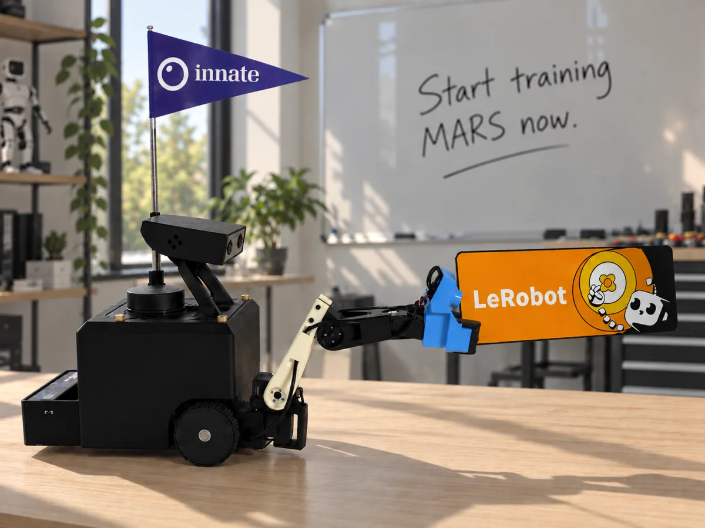
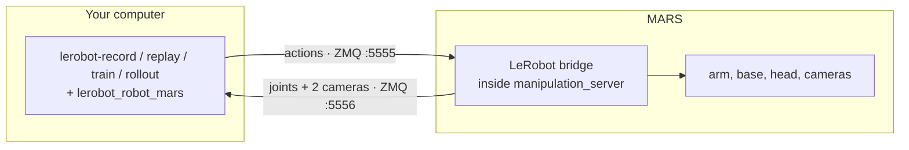

# MARS on LeRobot

<p align="center">
  
</p>

`lerobot_robot_mars` makes the [Innate MARS](https://www.innate.bot/) a first-class
[LeRobot](https://github.com/huggingface/lerobot) robot. Record demonstrations, train a policy
with any LeRobot model, and run it on the robot, all with the standard LeRobot commands and
`--robot.type=mars`.

What you get:

- **Record** LeRobotDataset v3 datasets while you drive the robot the way you already do: the
  phone app, the web app's Teleop page, or the leader arm.
- **Replay** recorded episodes on the robot.
- **Train** ACT, Diffusion Policy, SmolVLA, π0 and the rest of the LeRobot policy zoo on your data.
- **Run** a trained policy on the robot with `lerobot-rollout`.
- **Publish** to the Hugging Face Hub. Datasets recorded in the web app or the phone app publish
  too, from a button in the web app.

An example dataset recorded this way:
[innate-inc/mars-pick-tv](https://huggingface.co/datasets/innate-inc/mars-pick-tv).

## Contents

- [How it works](#how-it-works)
- [Requirements](#requirements)
- [Setup](#setup)
- [The workflow](#the-workflow): [record](#1-record-a-dataset), [replay](#2-replay-an-episode),
  [train](#3-train-a-policy), [run](#4-run-the-policy-on-the-robot), [publish](#5-publish-to-the-hub)
- [Recording with the web app instead](#recording-with-the-web-app-instead)
- [Using the simulator](#using-the-simulator)
- [Reference](#reference)
- [Troubleshooting](#troubleshooting)
- [Development](#development)

## How it works



LeRobot runs on your computer and never touches ROS. It talks to a small bridge that ships with
innate-os: actions go in on one socket, joint states and both camera streams come out on the
other. The bridge is on by default and does nothing until a client connects.

The same commands also run on the robot's Jetson itself, in this package's own Python 3.12
environment, with `MARS_HOST=localhost`.

## Requirements

| | |
|---|---|
| **Robot** | MARS on **innate-os 0.8.0 or newer** |
| **Computer** | macOS or Linux, on the same network as the robot |
| **Tools** | [uv](https://docs.astral.sh/uv/getting-started/installation/) and git. uv downloads Python 3.12 for you |
| **For training** | An NVIDIA GPU or Apple Silicon. Not needed for recording or replay |
| **Account** | A free [Hugging Face](https://huggingface.co/join) account, where your datasets are uploaded. Optional: everything also works offline |

## Setup

### 1. Update the robot

The bridge ships with innate-os 0.8.0. On the robot:

```bash
innate update apply
```

> [!NOTE]
> 0.8.0 is not released yet. Until it is, update to the latest `main` instead:
> `innate update --dev apply main`

Then check the manipulation server's log, in `innate view` or on the web app's Logging page. You
should see:

```
LeRobot bridge listening on :5555 (actions) and :5556 (observations)
```

### 2. Install on your computer

```bash
git clone https://github.com/innate-inc/innate-os.git
cd innate-os/lerobot
uv sync
```

`uv sync` creates `.venv` with LeRobot, this plugin, and everything the record, viewer and
training commands need. Run every command below from this folder.

### 3. Point it at your robot

Tell your computer where the robot is, once per terminal. The robot's IP address is the most
reliable choice:

```bash
export MARS_HOST=192.168.1.42
```

To find the address, run `hostname -I` on the robot.

Every command reads `MARS_HOST` and refuses to start without it. `--robot.remote_ip=…` and
`--teleop.remote_ip=…` override it for a single command. Once connected, each command logs the
robot it reached.

### 4. Check the connection

```bash
uv run lerobot-teleoperate --robot.type=mars --robot.external_commands=true \
    --teleop.type=mars_passthrough --display_data=true
```

A [Rerun](https://rerun.io/) window opens with both camera streams and live joint plots. Drive
the robot from the phone app or the web app and watch them move. The robot's log says
`LeRobot client connected`. Stop with Ctrl+C.

### 5. Log in to Hugging Face

The record command below uploads your dataset to your account when a session ends, as LeRobot
does by default, so log in once now. You can also stay offline: recording, replay, training and
running a policy all work without an account if you add `--dataset.push_to_hub=false` when you
record.

Being logged in lets you:

- upload a dataset or a trained policy to the Hub,
- download a private dataset, for example to train on another machine,
- use pretrained models that sit behind a license, such as the PaliGemma weights behind π0. Accept
  the license on the model's Hub page first.

Log in from the terminal. The command offers your browser, or takes a token with **write**
permission from [huggingface.co/settings/tokens](https://huggingface.co/settings/tokens):

```bash
uv run hf auth login
uv run hf auth whoami     # prints your account name
```

That account name is what `YOUR_HF_NAME` stands for in the commands below. A dataset is named
`account/dataset`, like a GitHub repository. Before you log in it is only a folder name, so any
name works, but using your real one now means the dataset uploads later without renaming. An
organization you belong to works too, such as `innate-inc/mars-pick-tv`.

## The workflow

### 1. Record a dataset

Drive the robot however you normally do: the phone app, the web app's Teleop page, or the leader
arm. LeRobot records what you command, so there is no new teleop hardware to set up. Prefer to
record on the robot itself, with no terminal? See
[Recording with the web app instead](#recording-with-the-web-app-instead).

```bash
uv run lerobot-record \
    --robot.type=mars --robot.external_commands=true --teleop.type=mars_passthrough \
    --dataset.repo_id=YOUR_HF_NAME/mars-tidy-up --dataset.no_stamp=true \
    --dataset.single_task="Put the ball in the box" \
    --dataset.fps=30 --dataset.num_episodes=10 --dataset.private=true
```

| Key | During recording |
|---|---|
| Right arrow | End this episode and move on |
| Left arrow | Discard this episode and record it again |
| Escape | Stop and save |

The dataset is saved under `~/.cache/huggingface/lerobot/YOUR_HF_NAME/mars-tidy-up`. When the
session ends it is also uploaded to `huggingface.co/datasets/YOUR_HF_NAME/mars-tidy-up` as a
private dataset. Leave out `--dataset.private=true` to publish it openly, or add
`--dataset.push_to_hub=false` to keep it on your computer only.

**Add more episodes later** by repeating the command with two extra flags. LeRobot needs the
dataset's folder spelled out to resume, and `num_episodes` then counts this session only:

```bash
    --resume=true --dataset.root=$HOME/.cache/huggingface/lerobot/YOUR_HF_NAME/mars-tidy-up
```

> [!TIP]
> Fifty clean episodes of one task, with the object placed a little differently each time, is a
> good first dataset. The head holds one tilt angle for the whole dataset automatically; see
> [Head angle](#head-angle).

### 2. Replay an episode

A quick way to confirm that what was recorded is what the robot did:

```bash
uv run lerobot-replay --robot.type=mars \
    --dataset.repo_id=YOUR_HF_NAME/mars-tidy-up --dataset.episode=0
```

> [!IMPORTANT]
> Leave teleop first, in the phone app and in the web app. While either one is teleoperating it
> keeps sending its own commands, and those win over LeRobot's. This applies to replay and to
> running a policy.

### 3. Train a policy

Training runs on your computer, not on the robot. ACT is the best first model: it is small,
trains quickly, and works with tens of episodes.

```bash
uv run lerobot-train \
    --dataset.repo_id=YOUR_HF_NAME/mars-tidy-up \
    --policy.type=act --policy.device=cuda \
    --output_dir=outputs/train/act_mars --job_name=act_mars \
    --steps=20000 --batch_size=8 --save_freq=5000 \
    --policy.push_to_hub=false --wandb.enable=false
```

- Use `--policy.device=mps` on Apple Silicon.
- 20 000 steps is a reasonable first pass; LeRobot's default is 100 000. Checkpoints land in
  `outputs/train/act_mars/checkpoints/`, and `last` always points at the newest.
- Out of GPU memory: lower `--batch_size`, and add `--policy.use_amp=true`.
- Training on a different machine: [publish](#5-publish-to-the-hub) the dataset, repeat
  [step 2 of Setup](#2-install-on-your-computer) there, and run the same command. It downloads
  the dataset from the Hub.

Other policies need their libraries first, for example `uv sync --extra smolvla`, then
`--policy.type=smolvla`. The extras are `diffusion`, `smolvla` and `pi`.

### 4. Run the policy on the robot

Put the robot in the scene you recorded in, leave teleop, then:

```bash
uv run lerobot-rollout --strategy.type=base \
    --policy.path=outputs/train/act_mars/checkpoints/last/pretrained_model \
    --policy.device=cuda \
    --robot.type=mars --task="Put the ball in the box" --duration=60
```

The policy runs on your computer and streams actions to the robot. It does not know when the
task is done; `--duration` ends the run, and so does Ctrl+C. The head moves to the angle the
training dataset was recorded at.

### 5. Publish to the Hub

Recording already uploads the dataset at the end of each session. For a dataset you recorded
offline, or when an upload failed halfway, push it by hand:

```bash
uv run mars-push YOUR_HF_NAME/mars-tidy-up --private
```

Leave out `--private` for a public dataset. Visibility is set when the dataset is first created, and
pushing again keeps it; to change it later, use the dataset's settings on the Hub. Public datasets also open in LeRobot's online
[dataset visualizer](https://huggingface.co/spaces/lerobot/visualize_dataset); private ones do not.

## Recording with the web app instead

You can also use the web app, or the phone app, to record datasets, the way the
[training docs](https://docs.innate.bot/training/overview) describe. No computer or terminal is
involved, and publishing converts the recording to the same LeRobotDataset format, so training and
running a policy work exactly as above. Everything you recorded before this integration existed
converts too.

| | `lerobot-record` | Web app or phone app |
|---|---|---|
| Runs on | Your computer | The robot |
| Setup | The steps above | None |
| Camera frames | Travel over Wi-Fi; a weak link shows up as repeated frames | Recorded on board at 30 fps |
| Reviewing episodes | Re-record on the spot with the left arrow | Watch and delete episodes on the Datasets page |
| Upload | Automatic when a session ends | **Publish to Hugging Face** button |
| Simulator | Yes | No |

For a recording session on a real robot, the web app is usually the easier and more robust choice.
`lerobot-record` fits when the rest of your work already lives in LeRobot, or in the simulator.

### Publish from the web app

On the Datasets page, a training dataset has a **Publish to Hugging Face** button.

1. Save a Hugging Face token with write permission under **Settings → Keys**.
2. Press **Publish to Hugging Face**. The first time, the dialog offers to install the LeRobot
   environment on the robot: a one-time download of about 1.5 GB.
3. Pick the account or organization, a repository name, and, for a new dataset, whether it is private.
   A dataset that already exists keeps the visibility it has on the Hub; the dialog shows which.

The job runs in the background and survives closing the dialog; reopen it to see progress.
Publishing again after recording more episodes converts only the new ones. After you delete an episode,
or mark one as failed, the next publish rebuilds the dataset without it and replaces the one on the Hub.

### Publish from the command line

Run it where the skill folder is: on your computer after copying the folder over, or on the
robot. `--push` needs the [login](#5-log-in-to-hugging-face) from Setup.

```bash
uv run mars2lerobot ~/innate-os/workspace/custom_skills/pick_cube \
    --repo-id YOUR_HF_NAME/mars-pick-cube --push --private
```

| Flag | Effect |
|---|---|
| `--task "…"` | Task text; defaults to the skill's guidelines |
| `--include-failures` | Also export episodes marked as failures |
| `--push`, `--private` | Upload to the Hub, as a private dataset |

The converter remembers which episodes it exported, so a rerun appends only the new ones.

## Using the simulator

No robot needed. Start the simulator (`./innate-sim up`), then run any command from this page
with `MARS_HOST=localhost`:

```bash
MARS_HOST=localhost uv run lerobot-teleoperate --robot.type=mars \
    --robot.external_commands=true --teleop.type=mars_passthrough --display_data=true
```

Drive the simulated robot from its web app. The simulator publishes the bridge on ports 5555 and
5556, or on `INNATE_SIM_PORT_BASE + 7` and `+ 8` when you moved its port block.

### Recording datasets in the simulator

By default the simulator renders its cameras at the rates of the robot's compressed streams: 10 fps
for the head and 6 fps for the wrist. A 30 fps dataset recorded that way repeats most frames. To
render at the robot's capture rates instead, start the simulator with one flag:

```bash
./innate-sim down
INNATE_SIM_HARDWARE_CAMERA_RATES=1 ./innate-sim up
```

| Camera | Default | With the flag | Real robot |
|---|---|---|---|
| Head | 10 fps | 15 fps | 15 fps |
| Wrist | 6 fps | 30 fps | 30 fps |

The higher rates apply only while something reads the raw camera topics, such as a connected
LeRobot client, and skills see the same compressed streams either way. It is off by default
because it triples the rendering work: it needs a GPU on the host, and on software rendering
the simulator cannot keep up and lowers the rates by itself.

## Reference

### Dataset format

| Feature | dtype · shape | Contents |
|---|---|---|
| `observation.state` | float32 · (6,) | `joint1.pos` … `joint6.pos` in rad; joint 6 is the gripper |
| `observation.images.head` | video · (480, 640, 3) | Head camera, RGB |
| `observation.images.wrist` | video · (480, 640, 3) | Wrist camera, RGB |
| `action` | float32 · (8,) | Six joint targets, then `x.vel` (m/s) and `theta.vel` (rad/s) for the base |

Everything runs at 30 fps. `lerobot_robot_mars/schema.py` is the single definition, shared by
the live client and the converter.

### Head angle

What the head camera sees depends on the head's tilt, so the tilt is fixed per dataset and
stored in the dataset's `meta/mars.json`. You normally never set it. When a command connects, it
picks the angle and holds the head there:

| You are… | Head angle |
|---|---|
| Recording a new dataset | -20°, the robot's "AI position" |
| Resuming or replaying a dataset | That dataset's angle |
| Running a policy | The angle of the dataset it was trained on |

`--robot.head_angle_deg=<deg>` overrides this, and `--robot.hold_head=false` leaves the head alone.

### Robot options

| Flag | Default | Meaning |
|---|---|---|
| `--robot.remote_ip` | `$MARS_HOST` (required) | Where the robot is |
| `--robot.external_commands` | `false` | `true` while you teleoperate the usual way: LeRobot records your commands and sends none of its own |
| `--robot.head_angle_deg` | from the dataset | See [Head angle](#head-angle) |
| `--robot.hold_head` | `true` | Keep the head at that angle for the whole session |

### Safety behaviour of the bridge

- Commands are ignored while the robot runs a recorded or learned behavior of its own. Code skills and
  the agent are not covered: the base is safe behind the velocity mux, where app teleop always wins, but
  the arm has no such arbiter, so do not run a LeRobot policy while a skill or the agent moves the arm.
- The base moves only for actions that carry `x.vel` and `theta.vel`. An arm-only source, such as a
  leader arm or an arm-only policy, leaves the base to navigation. While a client does drive the base,
  it outranks navigation, as a running skill does.
- The base stops if a client that drives it goes silent for half a second.
- Gripper targets are held to -0.6 to 0.85 rad, so a policy cannot squeeze hard enough to trip the servo.
  LeRobot records the action as the teleoperator or policy produced it, so a source that commands
  beyond that range records the unclamped value.
- Speed and joint limits are enforced by the robot's own drivers, as for every other command source.
- The bridge has no login, like the rest of the robot's local network interfaces. Settings live
  under `lerobot_bridge:` in `manipulation_server.yaml`: `bind_address: "127.0.0.1"` keeps it to
  the robot itself, and `enabled: false` turns it off.

### Trying a model that is only on LeRobot `main`

New policies land on LeRobot's `main` weeks before a release. The plugin uses only the stable
robot, teleoperator and dataset interfaces, so it runs unchanged against `main`:

```bash
uv pip install --python .venv/bin/python \
    "lerobot[dataset,lawam] @ git+https://github.com/huggingface/lerobot@main"
```

Swap `lawam` for the extra of the policy you want. `uv sync` puts the released version back.

## Troubleshooting

| Symptom | Cause and fix |
|---|---|
| `Set MARS_HOST to the robot's IP address first` | No robot address was given. Run `export MARS_HOST=<robot IP>` in this terminal, or pass `--robot.remote_ip=…`. |
| `No 'obs' messages from the MARS bridge` | The robot is not reachable at `MARS_HOST`. Use its IP address, check you are on the same network, and look for the `LeRobot bridge listening` log line. |
| `The MARS bridge sends no [...] frames` | That camera is not running on the robot. Check the camera drivers in `innate view`; recording now would store blank frames. |
| `The MARS bridge ... stopped answering` | The robot rebooted, the network dropped, or innate-os restarted mid-session. Episodes saved before that are intact; reconnect and resume. |
| `... already exists on Hugging Face and was not published from this skill` | Publishing replaces the dataset on the Hub, so it only reuses a name this skill published to before. Choose another name. |
| Log says `LeRobot bridge disabled: …` | The line names the reason. `innate update reinstall` installs a missing dependency and rebuilds. |
| Replay or a policy moves the arm oddly and the base not at all | The phone app or the web app is still teleoperating. Leave teleop first. |
| The robot ignores actions | The robot is running a recorded or learned behavior of its own. Wait for it to finish. |
| The base stops half a second after the last action | That is the watchdog. Send actions continuously, as the LeRobot commands do. |
| `lerobot-train` asks for a `repo_id` | Add `--policy.push_to_hub=false`. |
| `401 Unauthorized` or `403 Forbidden` from the Hub | Not logged in, a read-only token, or a name you cannot write to. See [Log in to Hugging Face](#5-log-in-to-hugging-face). |
| `zsh: no such file or directory: you` | A placeholder was pasted literally. Replace `YOUR_HF_NAME` with your Hugging Face name. |
| `torchcodec is installed but cannot be loaded`, `AVFFrameReceiver is implemented in both` on macOS | Harmless. LeRobot falls back to PyAV. |

> [!WARNING]
> Never `pip install lerobot` into the Jetson's system Python. It replaces the pinned numpy and
> breaks the robot's camera pipeline. Use this package's uv environment.

## Development

```bash
uv run pytest
```

The tests run the real bridge module from `ros2_ws/src/brain/manipulation` against the client,
so the wire protocol is pinned on both sides. CI runs them whenever the plugin or the bridge changes. The protocol itself is documented in
`lerobot_robot_mars/wire.py`.

### Why `uv.lock` is about 2,500 lines

`pyproject.toml` names five dependencies, but installing them pulls in about 130 packages, mostly
through LeRobot, torch and the Hugging Face libraries. `uv.lock` records the exact version of every
one, with a download link and checksum for each supported platform: Apple Silicon, Linux on x86,
Linux on ARM for the Jetson, and Windows. That is what makes the file long, and it is generated, never
edited by hand.

It is committed so that `uv sync` gives everyone, and every robot, exactly the set of packages
this plugin was tested with, instead of whatever is newest on the day they install. After changing
the dependencies in `pyproject.toml`, run `uv lock` and commit the result.

Licensed under Apache-2.0, like the rest of innate-os.
