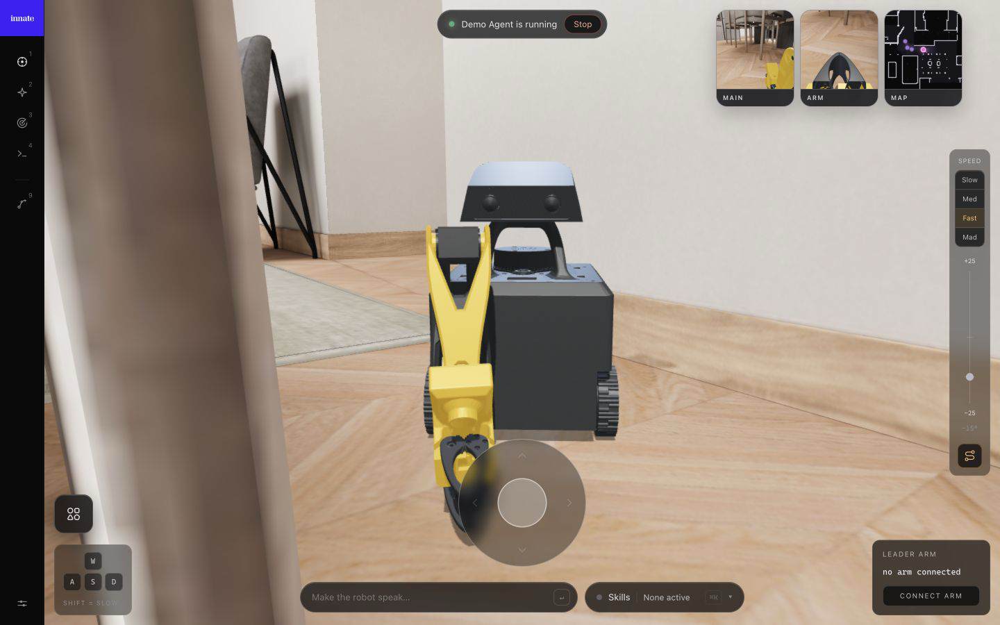

# The Innate Simulator

<p align="center">
  
</p>

A complete simulation of the [MARS](https://innate.bot) home robot that runs
on your laptop — **no robot required**. It is a true digital twin: the same
software that runs on a physical MARS (navigation, skills, the AI agent, the
web app) runs here against a physics simulation of the robot in a furnished
apartment. You drive it, run skills on it, and talk to its agent from your
browser, exactly as you would with the real thing — which also means
anything you build against the simulator works unchanged on a real MARS.

## Setup

You need two tools installed; everything else (world geometry, the Docker
image, the ROS build) is provisioned automatically on first start:

- **Docker** — runs the robot's software stack in a container.
- **uv** — runs the physics world natively on your machine
  (`./innate-sim setup` offers to install this one for you).

A machine with 4 CPU cores and 8 GB of RAM is comfortable. The first start
downloads and builds a few GB, so it takes a while; later starts take
seconds.

<details>
<summary><b>macOS</b></summary>

Install Docker Desktop and start it:

```bash
brew install --cask docker
```

(or download it from [docker.com](https://docs.docker.com/get-started/get-docker/)).

</details>

<details>
<summary><b>Linux (Ubuntu / Debian / Raspberry Pi OS)</b></summary>

On Ubuntu:

```bash
sudo apt install docker.io docker-compose-v2
```

On Debian / Raspberry Pi OS (whose `docker-compose` package is the old v1
tool), use Docker's own install script instead:

```bash
curl -fsSL https://get.docker.com | sudo sh
```

Then let your user talk to Docker:

```bash
sudo usermod -aG docker $USER && newgrp docker
```

Desktop installs already have working OpenGL. On a headless server or VM,
also install the offscreen rendering libraries:

```bash
sudo apt install libegl1 libgl1 libopengl0 libosmesa6
```

</details>

<details>
<summary><b>Windows (WSL2)</b></summary>

The sim runs inside WSL2. In PowerShell:

```powershell
wsl --install -d Ubuntu
```

then open the Ubuntu terminal and follow the **Linux** steps above. WSLg
(included in current WSL) gives the sim GPU-accelerated rendering
automatically.

One caution: use exactly **one** Docker — either Docker Desktop (with WSL
integration enabled) or `docker.io` installed inside WSL. Having both
installed makes the `docker` command hang in confusing ways.

</details>

Then, from the repository root:

```bash
./innate-sim setup     # checks prerequisites (offers to install uv) + configures your agent keys
./innate-sim up        # starts everything; leave the live dashboard open
```

`setup` asks which brain the robot's AI agent should use:

- **Hosted Innate brain** — uses your Innate service key (it comes with a
  MARS robot). The full experience, including voice — the robot speaks.
- **Local brain (Gemini)** — runs the open-source agent on your machine
  against a [Gemini API key](https://aistudio.google.com/api-keys).
  Everything works except voice: the web app's speak bar is disabled
  without a service key.
- **None** — no agent; you can still drive, navigate, and trigger skills
  manually.

Rerun `./innate-sim setup` anytime to switch.

**Open [https://localhost](https://localhost)** (accept the self-signed
certificate) — you are looking at the robot's web app. Drive with the
joystick or WASD, switch between the 3D view, the robot's cameras, and the
map, trigger skills, and chat with the agent. Add `?simperf` to the URL for
a frame-time / latency HUD.

Every error along the way is written to tell you exactly what to do next.
If something stops you anyway, we want to hear about it —
[join our Discord](https://discord.gg/innate).

### Everyday commands

```bash
./innate-sim status      # startup checks + health snapshot
./innate-sim logs        # startup logs; `logs os` / `logs agent` follow live
./innate-sim sh          # shell into the container; `innate build` rebuilds ros2_ws
./innate-sim down        # stop
./innate-sim clean       # remove containers/volumes (keeps .env + config)
```

## Build skills and agents

The simulator shares the repository's [`workspace/`](../workspace/) with the
container, so the skills and agents you write for the sim are the ones a
real robot runs — develop here, deploy there. Start with the docs:

- [Skills](https://docs.innate.bot/software/skills) — teach the robot new
  abilities in Python (or by demonstration on a real robot).
- [Agents](https://docs.innate.bot/software/agents) — give the AI brain
  goals, personality, and access to your skills.

### When do changes take effect?

| You edited | What to do |
|---|---|
| skills or agents in `workspace/` | **nothing** — they hot-reload on save (fallback: `ros2 service call /brain/reload std_srvs/srv/Trigger` in the container) |
| ROS code in `ros2_ws/src/` | inside the container: `innate build` then `innate restart` |
| the simulated world (`mars_sim_driver/` world/server) | `./innate-sim down && ./innate-sim up` — this part runs on the host |
| launcher / webapp files | just rerun `./innate-sim up` / reload the browser |

The container's ROS session lives in tmux (`./innate-sim sh`, then
`tmux attach -t innate`): one window per subsystem (zenoh, rosbridge,
sim-driver, nav-brain, behavior, arm-ik, vision-nav, console-webapp).

---

## Advanced

### VirtualMars: the sim as a Python object

For scripts, notebooks, and RL loops there is a second way in that needs no
ROS and no Docker: the apartment, the robot, its cameras, lidar and arm as a
single Python object — instantiate several in one process for parallel
rollouts.

▶ **Start with the walkthrough notebook:
[`sandbox/virtual_mars_demo.ipynb`](sandbox/virtual_mars_demo.ipynb)** —
camera/depth/lidar observations, driving, the arm, and the occupancy grid,
with rendered outputs inline.

```bash
./innate-sim assets          # one-time: fetch the world geometry (~100 MB, no Docker)
cd sim && uv sync --group notebook   # then open the notebook on the sim/.venv kernel
```

The API is shaped like a robot, not a physics engine:

```python
from mars_sim_driver.core import VirtualMars

sim = VirtualMars()
sim.step(1.0)                          # settle from spawn; step(dt) runs physics
sim.set_cmd_vel(0.3, 0.5)              # vx m/s, wz rad/s (0.5s watchdog)
sim.set_joint_target("joint2", -1.0)   # arm/head PD servo setpoints
x, y, yaw = sim.pose()                 # ground truth
rgb   = sim.render_rgb("main")         # 640x480 ("wrist" = arm camera)
depth = sim.render_depth("main")       # meters; robot's own geoms excluded
scan  = sim.lidar_scan(360, 12.0)      # planar lidar off the visual surfaces
grid, ox, oy = sim.occupancy_grid()    # rasterized nav map (-1/0/100)
sim.reset()                            # back to spawn, arm home
```

Rendering is lazy — pure physics is cheap. For a native MuJoCo viewer window
(WASD driving, arm sliders in a browser control panel):

```bash
cd sim && uv run sandbox/drive_mars.py
```

More dev tooling (physics stress gate, asset pipeline) is documented in
[`sandbox/README.md`](sandbox/README.md).

### ROS access

A Foxglove bridge runs as part of the sim stack: connect Foxglove Studio to
`ws://localhost:8765` for TF, `/scan`, `/mars/main_camera/points`, camera
topics and `/cmd_vel` teleop. (With the local brain active the bridge is
published on `ws://localhost:8766` instead — the cloud-agent owns 8765; the
launcher prints the port. `SIM_FOXGLOVE_PORT`/`SIM_FOXGLOVE_BIND` override.)

Rosbridge is also available for your own ROS tooling at `ws://localhost:9090`.

### Configuration

- repo-root `.env` — secrets (`INNATE_SERVICE_KEY`, brain backend keys);
  `./innate-sim setup` walks through them.
- `config/settings.yaml` — optional non-secret ROS parameter tunables and
  extra agent/skill dirs.
- `sim/config.toml` — optional overrides (OS image, cloud-agent mode),
  created from `config.toml.template` by setup.
- `sim/cloud-agent.lock` — the innate-cloud-agent revision this checkout is
  tested against: setup clones/aligns to it (and asks before touching an
  existing checkout); `up` only warns on mismatch, so forks and pinned
  experiments are never modified.
- `INNATE_SIM_RENDER_SCALE=N` — render the robot cameras at 1/N resolution
  (the wire format stays 640×480). On machines stuck with software rendering
  (`software-speed` in the dashboard's World field), `2` makes each frame
  ~4× cheaper and noticeably lowers end-to-end latency.

---

## How it works

The sim is a stack of four layers inside
`ros2_ws/src/mars_bot/mars_sim_driver/`; each is usable without the ones
above it:

```
node.py          mars_sim_driver -- thin ROS 2 client impersonating the hardware drivers
world_server.py  world host      -- owns the world + clock; driver RPC + observer stream
core.py          VirtualMars     -- the simulation itself (physics + sensors), no ROS
world.py         model building  -- MJCF world + URDF robot, pure functions
```

### world.py — the model

Builds the MuJoCo model: apartment collision hulls + textured visual rooms
(from `sim/assets`), the real `mars.urdf` attached on a planar base (x/y/yaw
— a wheeled robot can't pitch), drive gains and contact parameters. Pure
functions over files; `sim/sandbox` imports it for the native viewers, and a
future GPU/batched backend (e.g. MuJoCo Warp) would consume the same spec.

### core.py — VirtualMars

The layer you use directly in the VirtualMars section above.
`update_camera()` / `read_rgb()` are split (same for depth) so callers can
update the scene under a lock but render outside it — that's what keeps
physics from stalling in the world server.

### world_server.py — the world host

Hosts one VirtualMars behind two localhost interfaces, one per kind of
consumer (the invariant: robot software sees the world only through the
robot adapter; humans and tools see it only through the observer stream):

- **driver RPC** (port 8799) — sensing/actuation for node.py, robot-shaped
  and rate-limited like real hardware. Renders are demand-paced: a camera
  or depth product renders once per client pull (~8Hz), never free-running.
- **observer stream** (WebSocket, port 8800; the webapp proxies it at
  `/worldstate`) — ground truth `{t, wall, pose, joints}` pushed after
  every physics slice (~75Hz), latest-wins per client. The 3D view consumes
  this; future challenge UIs/graders are just more clients.

Physics steps against the wall clock in <=25ms slices (a stall replays as
several smooth slices, never one teleport), with all GL work on the main
thread — macOS GL is main-thread-sensitive. The world always runs on the
host, started by the launcher via `uv` (which is why `uv` is a
prerequisite): native/WSLg GL renders ~7x faster than software GL in
Docker, and physics never competes with the ROS stack for the container's
CPU. The container ships no MuJoCo at all — the driver node is a pure RPC
client. `./innate-sim logs world-server` shows the host server log.

### node.py — mars_sim_driver (the digital twin's hardware)

The ROS adapter that makes the world *be* the robot: a thin RPC client of
the world server publishing the exact topic surface of the hardware
drivers — same topics, types, rates and frame names — so everything above
(Nav2, AMCL, brain, webapp, Foxglove) runs unmodified. The full
topic/service surface with rates is in the `node.py` module docstring;
highlights:

- `/odom` + TF @30Hz, `/scan` @6Hz, cameras @7.5/5Hz JPEG, depth + point
  cloud @8Hz with the real stereo pipeline's [0.25, 2.0]m clamp
- arm/head command topics and `goto_js*` services; streamed setpoints
  replay on the stream's own timeline, so clumped delivery under load
  still plays back at the commanded rate
- latched `/robot_info` `{"simulated": true}` — how the webapp knows to
  render the Three.js view instead of opening WebRTC
- `/virtual_mars/reset` (sim-only)

Camera topics render lazily — no subscribers, no render requests, no GL
work — which is what makes headless runs cheap.

`sim_driver.launch.py` also starts `robot_state_publisher` (same URDF as the
real bringup) and `grid_localizer_sim`, the stand-in for the CUDA-only
grid_localizer: identical lifecycle/service contract, but it seeds AMCL from
ground truth (republishing until AMCL confirms with `/amcl_pose`).

### Assets

The generated geometry (driver meshes in `sim/assets/`, the viewer's hulls,
GLB, robot meshes, and the prebuilt viewer bundle) is not in git:
`./innate-sim up` (or `./innate-sim assets`) downloads the bundle pinned by
`sim/sim-assets.lock` from a GitHub release and extracts it in place
(one-time, ~100 MB). To change the geometry, run the pipeline in
`sim/tools/` (see [`sandbox/README.md`](sandbox/README.md)), then
`uv run tools/publish_assets.py --publish` to publish + repin the lock.
Publishing rebuilds the viewer bundle first, so Node.js is only needed when
editing `sim/viewer` or publishing — never to run the sim. While iterating
on `sim/viewer`, set `INNATE_SIM_VIEWER_DEV=1` so `up` rebuilds the bundle
from source when it is stale; without it the prebuilt bundle is always used
as-is.

### Credits

The apartment environment is derived from ["Appartement"](https://sketchfab.com/3d-models/appartement-6a7a5fe208344b2e8123a88923dbd5b3) by [SrMonteiro](https://sketchfab.com/crispimrafael), licensed under [CC BY 4.0](https://creativecommons.org/licenses/by/4.0/). Changes were made: split per room, convex-decomposed for collision, re-exported for rendering (GLB/MuJoCo meshes), and rasterized into a navigation map.
